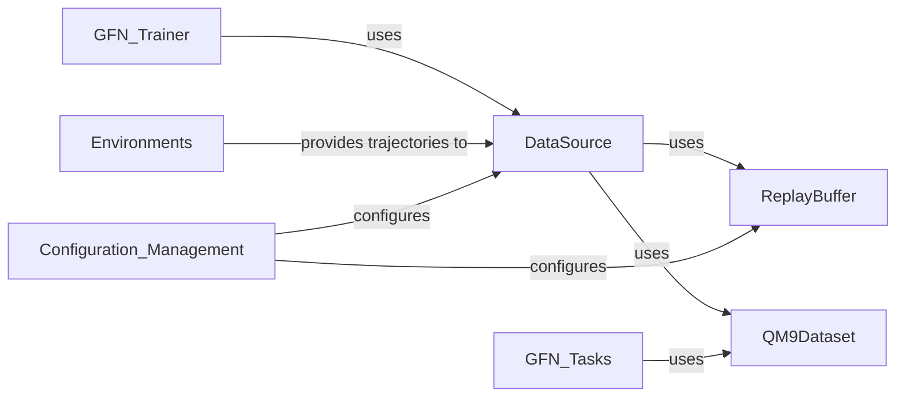

## Details

The `Data Management` component is crucial for the GFlowNet framework as it underpins the entire training process by providing and managing the data necessary for learning. It handles the initial datasets and the dynamic storage of experience replay data, which is vital for the stability and efficiency of off-policy reinforcement learning algorithms used in GFlowNets.

### DataSource
The `DataSource` acts as a unified interface for providing data to the GFlowNet trainer. It can combine multiple data sources, such as samples generated by the GFlowNet model itself, data from a replay buffer, or pre-existing datasets. It orchestrates the sampling process, computes properties and rewards for trajectories, and manages the flow of data to the training algorithms.

**Related Classes/Methods**:

- <a href="https://github.com/recursionpharma/gflownet/blob/trunk/src/gflownet/data/data_source.py#L1-L1" target="_blank" rel="noopener noreferrer">`gflownet.data.data_source` (1:1)</a>

### ReplayBuffer
The `ReplayBuffer` stores past trajectories (experiences) generated by the GFlowNet model. It allows for efficient sampling of these experiences, which is critical for off-policy learning algorithms like those used in GFlowNets. By re-using past data, it helps to decorrelate samples, improve data efficiency, and stabilize training.

**Related Classes/Methods**:

- <a href="https://github.com/recursionpharma/gflownet/blob/trunk/src/gflownet/data/replay_buffer.py#L1-L1" target="_blank" rel="noopener noreferrer">`gflownet.data.replay_buffer` (1:1)</a>

### QM9Dataset
QM9Dataset is a concrete implementation of a dataset handler specifically for the QM9 dataset, a widely used benchmark in computational chemistry for molecular property prediction. It loads molecular data (SMILES strings) and their associated properties (e.g., 'gap') from HDF5 or XYZ files, converting them into a format usable by the GFlowNet.

**Related Classes/Methods**:

- <a href="https://github.com/recursionpharma/gflownet/blob/trunk/src/gflownet/data/qm9.py#L1-L1" target="_blank" rel="noopener noreferrer">`gflownet.data.qm9` (1:1)</a>

### [FAQ](https://github.com/CodeBoarding/GeneratedOnBoardings/tree/main?tab=readme-ov-file#faq)