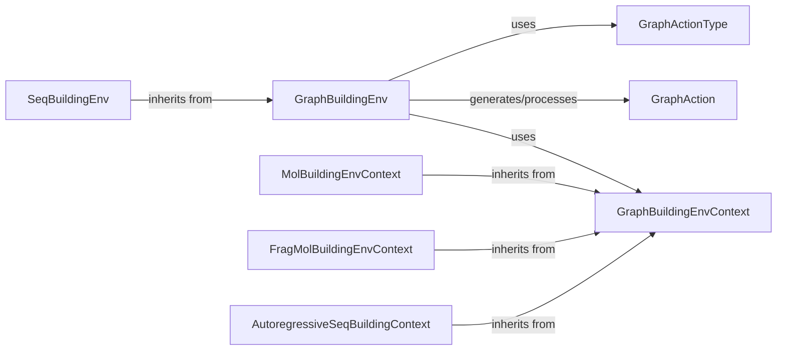

## Details

The `Environment Simulator` component is crucial for defining the generative process within the GFlowNet framework. It abstracts the concept of building structured data (graphs, molecules, sequences) into a Markov Decision Process (MDP), specifying the state space, valid actions, and transition dynamics. This allows the GFlowNet algorithms to interact with a consistent interface regardless of the specific data type being generated. These components are fundamental because they collectively define the "rules of the game" for the GFlowNet. Without a well-defined environment, the GFlowNet cannot explore the state space, take meaningful actions, or learn the generative process. The modular design, with base classes for environments and contexts, allows for easy extension to new data types and generative paradigms while maintaining a consistent interface for the core GFlowNet algorithms.

### GraphBuildingEnv
This is the abstract base class for all generative environments. It defines the fundamental interface for managing the state space, valid actions, and state transition dynamics for building structured data, particularly graphs. It provides methods for stepping through the generative process, resetting the environment, and obtaining information about the current state.

**Related Classes/Methods**:

- <a href="https://github.com/recursionpharma/gflownet/blob/trunk/src/gflownet/envs/graph_building_env.py#L127-L373" target="_blank" rel="noopener noreferrer">`gflownet.envs.graph_building_env.GraphBuildingEnv` (127:373)</a>

### GraphBuildingEnvContext
This class serves as the base context for graph-building environments. It encapsulates common utilities, rules, and definitions necessary for the generative process, such as atom types, bond types, and methods for converting between internal graph representations and external formats (e.g., RDKit molecules). It's responsible for providing the environment with the necessary domain-specific knowledge.

**Related Classes/Methods**:

- <a href="https://github.com/recursionpharma/gflownet/blob/trunk/src/gflownet/envs/graph_building_env.py#L898-L1020" target="_blank" rel="noopener noreferrer">`gflownet.envs.graph_building_env.GraphBuildingEnvContext` (898:1020)</a>

### MolBuildingEnvContext
A concrete implementation of `GraphBuildingEnvContext` specifically tailored for molecule generation. It defines molecular-specific properties like atom types, bond types, and valency rules, and provides methods for validating molecular structures.

**Related Classes/Methods**:

- <a href="https://github.com/recursionpharma/gflownet/blob/trunk/src/gflownet/envs/mol_building_env.py#L16-L471" target="_blank" rel="noopener noreferrer">`gflownet.envs.mol_building_env.MolBuildingEnvContext` (16:471)</a>

### FragMolBuildingEnvContext
Another concrete implementation of `GraphBuildingEnvContext`, designed for fragment-based molecule generation. This context handles the specific rules and actions involved when building molecules by adding predefined fragments rather than individual atoms and bonds.

**Related Classes/Methods**:

- <a href="https://github.com/recursionpharma/gflownet/blob/trunk/src/gflownet/envs/frag_mol_env.py#L15-L379" target="_blank" rel="noopener noreferrer">`gflownet.envs.frag_mol_env.FragMolBuildingEnvContext` (15:379)</a>

### SeqBuildingEnv
A concrete environment for sequence generation, inheriting from `GraphBuildingEnv`. It adapts the graph-building paradigm to sequential data, defining states as partial sequences and actions as appending tokens.

**Related Classes/Methods**:

- <a href="https://github.com/recursionpharma/gflownet/blob/trunk/src/gflownet/envs/seq_building_env.py#L30-L57" target="_blank" rel="noopener noreferrer">`gflownet.envs.seq_building_env.SeqBuildingEnv` (30:57)</a>

### AutoregressiveSeqBuildingContext
A concrete implementation of `GraphBuildingEnvContext` (via `SeqBuildingEnv`) for autoregressive sequence building. It defines the vocabulary and rules specific to generating sequences token by token.

**Related Classes/Methods**:

- <a href="https://github.com/recursionpharma/gflownet/blob/trunk/src/gflownet/envs/seq_building_env.py#L81-L132" target="_blank" rel="noopener noreferrer">`gflownet.envs.seq_building_env.AutoregressiveSeqBuildingContext` (81:132)</a>

### GraphAction
Represents a single action that can be taken within a `GraphBuildingEnv`. It encapsulates the type of action (e.g., add node, add edge) and any associated parameters (e.g., node type, edge type, target nodes).

**Related Classes/Methods**:

- <a href="https://github.com/recursionpharma/gflownet/blob/trunk/src/gflownet/envs/graph_building_env.py#L99-L124" target="_blank" rel="noopener noreferrer">`gflownet.envs.graph_building_env.GraphAction` (99:124)</a>

### GraphActionType
An enumeration defining the various types of actions that can be performed in a graph-building environment (e.g., `ADD_NODE`, `ADD_EDGE`, `SET_NODE_ATTR`, `STOP`).

**Related Classes/Methods**:

- <a href="https://github.com/recursionpharma/gflownet/blob/trunk/src/gflownet/envs/graph_building_env.py#L57-L80" target="_blank" rel="noopener noreferrer">`gflownet.envs.graph_building_env.GraphActionType` (57:80)</a>

### [FAQ](https://github.com/CodeBoarding/GeneratedOnBoardings/tree/main?tab=readme-ov-file#faq)