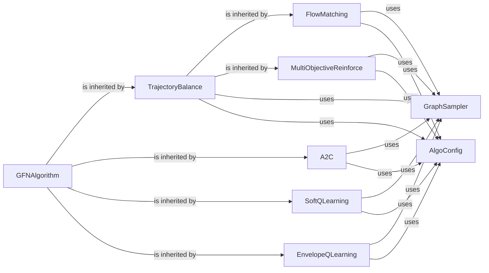

## Details

The GFN Algorithm Implementations component is the heart of the GFlowNet framework, encapsulating the core learning algorithms that drive the generative policy optimization. It defines the specific loss functions and learning rules, enabling the model to learn to generate structured data (e.g., graphs) by optimizing a policy that explores the state space. This component interacts closely with the environment to collect trajectories and with neural network models to update the generative policy based on the computed losses.

### GFNAlgorithm
This abstract base class defines the common interface and shared functionalities for all GFlowNet learning algorithms. It provides a blueprint for how different algorithms should interact with the environment, models, and data.

**Related Classes/Methods**:

- `GFNAlgorithm`

### TrajectoryBalance
Implements the Trajectory Balance (TB) algorithm, a foundational GFlowNet learning rule that aims to balance the flow of probability along forward and backward trajectories.

**Related Classes/Methods**:

- <a href="https://github.com/recursionpharma/gflownet/blob/trunk/src/gflownet/algo/trajectory_balance.py#L70-L776" target="_blank" rel="noopener noreferrer">`TrajectoryBalance` (70:776)</a>

### FlowMatching
Implements the Flow Matching (FM) algorithm, another key GFlowNet variant that focuses on matching the flow of probability at each state.

**Related Classes/Methods**:

- <a href="https://github.com/recursionpharma/gflownet/blob/trunk/src/gflownet/algo/flow_matching.py#L35-L190" target="_blank" rel="noopener noreferrer">`FlowMatching` (35:190)</a>

### A2C
Implements the Advantage Actor-Critic (A2C) algorithm adapted for GFlowNet, combining policy-based and value-based methods for learning.

**Related Classes/Methods**:

- `A2C`

### SoftQLearning
Implements the Soft Q-Learning (SQL) algorithm, which incorporates an entropy regularization term to encourage exploration and improve robustness.

**Related Classes/Methods**:

- <a href="https://github.com/recursionpharma/gflownet/blob/trunk/src/gflownet/algo/soft_q_learning.py#L12-L190" target="_blank" rel="noopener noreferrer">`SoftQLearning` (12:190)</a>

### EnvelopeQLearning
Implements the Envelope Q-Learning (EQL) algorithm, a variant of Q-learning designed for GFlowNets.

**Related Classes/Methods**:

- <a href="https://github.com/recursionpharma/gflownet/blob/trunk/src/gflownet/algo/envelope_q_learning.py#L158-L406" target="_blank" rel="noopener noreferrer">`EnvelopeQLearning` (158:406)</a>

### MultiObjectiveReinforce
Implements a Reinforce-based algorithm specifically tailored for multi-objective GFlowNet tasks, where multiple rewards need to be optimized simultaneously.

**Related Classes/Methods**:

- `MultiObjectiveReinforce`

### GraphSampler
This component is responsible for generating trajectories (sequences of states and actions) by interacting with the environment and using the current generative policy (neural network model).

**Related Classes/Methods**:

- `GraphSampler`

### AlgoConfig
This component defines the configuration parameters specific to the GFlowNet algorithms, allowing for flexible and reproducible experimentation.

**Related Classes/Methods**:

- `AlgoConfig`

### [FAQ](https://github.com/CodeBoarding/GeneratedOnBoardings/tree/main?tab=readme-ov-file#faq)