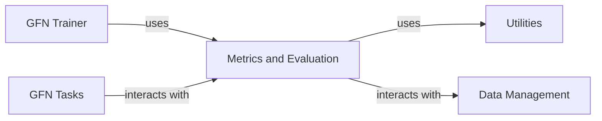

## Details

The `Metrics and Evaluation` component is fundamental to the GFlowNet framework as it provides the necessary mechanisms to quantify the performance of generative models, especially in complex multi-objective optimization scenarios. Its integration with the training process ensures that model development is guided by clear, measurable objectives, enabling effective hyperparameter tuning and model selection.

### Metrics and Evaluation [[Expand]](./Metrics_and_Evaluation.md)
This component is responsible for computing and tracking various performance metrics, with a particular focus on multi-objective optimization metrics like Hypervolume, IGD (Inverted Generational Distance), and HSR (Hypervolume Success Rate). It integrates with logging mechanisms to monitor training progress, evaluate model performance, and provide insights into the generative process.

**Related Classes/Methods**:

- <a href="https://github.com/recursionpharma/gflownet/blob/trunk/src/gflownet/utils/metrics.py" target="_blank" rel="noopener noreferrer">`gflownet.utils.metrics.compute_metrics`</a>
- <a href="https://github.com/recursionpharma/gflownet/blob/trunk/src/gflownet/utils/metrics.py" target="_blank" rel="noopener noreferrer">`gflownet.utils.metrics.hypervolume`</a>
- <a href="https://github.com/recursionpharma/gflownet/blob/trunk/src/gflownet/utils/metrics.py" target="_blank" rel="noopener noreferrer">`gflownet.utils.metrics.igd`</a>
- <a href="https://github.com/recursionpharma/gflownet/blob/trunk/src/gflownet/utils/multiobjective_hooks.py#L214-L238" target="_blank" rel="noopener noreferrer">`gflownet.utils.multiobjective_hooks.TopKHook` (214:238)</a>

### GFN Trainer
As the orchestrator of the learning process, the GFN Trainer is central. It brings together the model, environment, data, and algorithms to facilitate training. Its reliance on Metrics and Evaluation highlights the importance of performance monitoring during training.

**Related Classes/Methods**: _None_

### GFN Tasks
These components define the "what" of the GFlowNet. They encapsulate the specific problem being solved, including the state space, actions, and reward functions. Without well-defined tasks, the GFlowNet has no objective to optimize.

**Related Classes/Methods**: _None_

### Data Management
Essential for feeding data to the models and algorithms. In generative models, this includes handling generated samples, replay buffers, and potentially external datasets for training or evaluation.

**Related Classes/Methods**: _None_

### Utilities
These components provide foundational support across the entire framework, ensuring code reusability, consistency, and maintainability. Metrics and other components often rely on these general-purpose functions.

**Related Classes/Methods**: _None_

### [FAQ](https://github.com/CodeBoarding/GeneratedOnBoardings/tree/main?tab=readme-ov-file#faq)