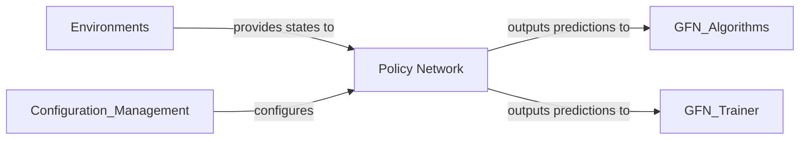

## Details

The `Policy Network` is the "brain" of the GFlowNet. It's responsible for learning the underlying generative distribution of the data. Without a well-designed and trained policy network, the GFlowNet cannot effectively explore the state space or generate high-quality data. The different model architectures (Graph Transformers, Sequence Transformers, MXMNet) allow the framework to be applied to various types of structured data (graphs, sequences), making it versatile. The `config.py` file is crucial for managing the complexity of these models and enabling easy experimentation with different architectures and hyperparameters.

### Policy Network [[Expand]](./Policy_Network.md)
Implements the neural network architectures (e.g., Graph Transformers, MXMNet, Sequence Transformers) that represent the GFlowNet policy. It takes the current environment state and conditional information as input and outputs predictions (e.g., action probabilities, state values) to guide the generative process. These models are fundamental as they learn the generative policy that guides the construction of structured data.

**Related Classes/Methods**:

- <a href="https://github.com/recursionpharma/gflownet/blob/trunk/src/gflownet/models/graph_transformer.py#L152-L292" target="_blank" rel="noopener noreferrer">`gflownet.models.graph_transformer.GraphTransformerGFN` (152:292)</a>
- <a href="https://github.com/recursionpharma/gflownet/blob/trunk/src/gflownet/models/seq_transformer.py#L29-L122" target="_blank" rel="noopener noreferrer">`gflownet.models.seq_transformer.SeqTransformerGFN` (29:122)</a>
- <a href="https://github.com/recursionpharma/gflownet/blob/trunk/src/gflownet/models/mxmnet.py#L33-L157" target="_blank" rel="noopener noreferrer">`gflownet.models.mxmnet.MXMNet` (33:157)</a>
- <a href="https://github.com/recursionpharma/gflownet/blob/trunk/src/gflownet/models/bengio2021flow.py" target="_blank" rel="noopener noreferrer">`gflownet.models.bengio2021flow`</a>
- <a href="https://github.com/recursionpharma/gflownet/blob/trunk/src/gflownet/models/config.py#L26-L41" target="_blank" rel="noopener noreferrer">`gflownet.models.config.ModelConfig` (26:41)</a>
- <a href="https://github.com/recursionpharma/gflownet/blob/trunk/src/gflownet/models/config.py#L7-L11" target="_blank" rel="noopener noreferrer">`gflownet.models.config.GraphTransformerConfig` (7:11)</a>
- <a href="https://github.com/recursionpharma/gflownet/blob/trunk/src/gflownet/models/config.py#L20-L22" target="_blank" rel="noopener noreferrer">`gflownet.models.config.SeqTransformerConfig` (20:22)</a>

### [FAQ](https://github.com/CodeBoarding/GeneratedOnBoardings/tree/main?tab=readme-ov-file#faq)