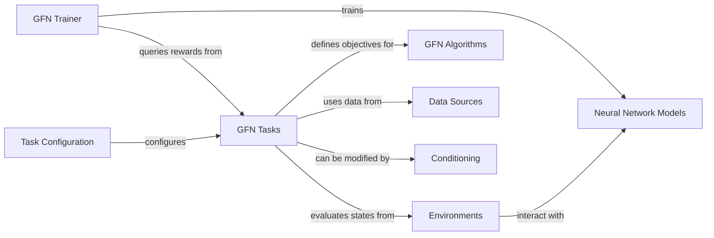

## Details

The `Task Specific Logic` component, identified as `GFN Tasks`, is central to defining the objectives and reward mechanisms within the GFlowNet framework. It encapsulates the problem-specific evaluation of generated data, providing crucial reward signals that guide the GFlowNet's learning algorithms.

### GFN Tasks
This is the core of the `Task Specific Logic`. `gflownet.GFNTask` serves as the abstract base class, defining the interface for all GFlowNet tasks, primarily through methods for reward calculation. Concrete implementations like `gflownet.tasks.qm9.QM9GapTask`, `gflownet.tasks.seh_frag.SEHTask`, and their multi-objective (MOO) variants (`gflownet.tasks.qm9_moo.QM9GapMOOTask`, `gflownet.tasks.seh_frag_moo.SEHMOOTask`) provide the specific logic for evaluating generated data (e.g., molecules from QM9 dataset, SEH molecules) and computing scalar or multi-objective rewards.

**Related Classes/Methods**:

- `gflownet.GFNTask`
- <a href="https://github.com/recursionpharma/gflownet/blob/trunk/src/gflownet/tasks/qm9.py#L21-L109" target="_blank" rel="noopener noreferrer">`gflownet.tasks.qm9.QM9GapTask` (21:109)</a>
- <a href="https://github.com/recursionpharma/gflownet/blob/trunk/src/gflownet/tasks/seh_frag.py#L22-L69" target="_blank" rel="noopener noreferrer">`gflownet.tasks.seh_frag.SEHTask` (22:69)</a>
- <a href="https://github.com/recursionpharma/gflownet/blob/trunk/src/gflownet/tasks/qm9_moo.py#L28-L189" target="_blank" rel="noopener noreferrer">`gflownet.tasks.qm9_moo.QM9GapMOOTask` (28:189)</a>
- <a href="https://github.com/recursionpharma/gflownet/blob/trunk/src/gflownet/tasks/seh_frag_moo.py#L53-L207" target="_blank" rel="noopener noreferrer">`gflownet.tasks.seh_frag_moo.SEHMOOTask` (53:207)</a>
- <a href="https://github.com/recursionpharma/gflownet/blob/trunk/src/gflownet/tasks/make_rings.py#L14-L26" target="_blank" rel="noopener noreferrer">`gflownet.tasks.make_rings.MakeRingsTask` (14:26)</a>
- <a href="https://github.com/recursionpharma/gflownet/blob/trunk/src/gflownet/tasks/toy_seq.py#L15-L37" target="_blank" rel="noopener noreferrer">`gflownet.tasks.toy_seq.ToySeqTask` (15:37)</a>

### Task Configuration
`gflownet.tasks.config.TasksConfig` and its specialized subclasses (e.g., `QM9TaskConfig`, `SEHTaskConfig`) manage the configuration parameters specific to each GFlowNet task. This includes settings related to reward functions, dataset paths, and other task-specific hyperparameters.

**Related Classes/Methods**:

- <a href="https://github.com/recursionpharma/gflownet/blob/trunk/src/gflownet/tasks/config.py#L65-L69" target="_blank" rel="noopener noreferrer">`gflownet.tasks.config.TasksConfig` (65:69)</a>
- <a href="https://github.com/recursionpharma/gflownet/blob/trunk/src/gflownet/tasks/config.py#L35-L37" target="_blank" rel="noopener noreferrer">`gflownet.tasks.config.QM9TaskConfig` (35:37)</a>
- <a href="https://github.com/recursionpharma/gflownet/blob/trunk/src/gflownet/tasks/config.py#L7-L8" target="_blank" rel="noopener noreferrer">`gflownet.tasks.config.SEHTaskConfig` (7:8)</a>

### Environments
`gflownet.envs.graph_building_env.GraphBuildingEnvContext` (and its concrete implementations like `MolBuildingEnvContext`, `FragMolBuildingEnvContext`, `AutoregressiveSeqBuildingContext`) defines the state space, actions, and rules for generating structured data (graphs or sequences). These environments produce the states that the `GFN Tasks` component then evaluates.

**Related Classes/Methods**:

- <a href="https://github.com/recursionpharma/gflownet/blob/trunk/src/gflownet/envs/graph_building_env.py#L898-L1020" target="_blank" rel="noopener noreferrer">`gflownet.envs.graph_building_env.GraphBuildingEnvContext` (898:1020)</a>
- <a href="https://github.com/recursionpharma/gflownet/blob/trunk/src/gflownet/envs/mol_building_env.py#L16-L471" target="_blank" rel="noopener noreferrer">`gflownet.envs.mol_building_env.MolBuildingEnvContext` (16:471)</a>
- <a href="https://github.com/recursionpharma/gflownet/blob/trunk/src/gflownet/envs/frag_mol_env.py#L15-L379" target="_blank" rel="noopener noreferrer">`gflownet.envs.frag_mol_env.FragMolBuildingEnvContext` (15:379)</a>
- <a href="https://github.com/recursionpharma/gflownet/blob/trunk/src/gflownet/envs/seq_building_env.py#L81-L132" target="_blank" rel="noopener noreferrer">`gflownet.envs.seq_building_env.AutoregressiveSeqBuildingContext` (81:132)</a>

### GFN Trainer
`gflownet.trainer.GFNTrainer` and its primary implementation `gflownet.online_trainer.StandardOnlineTrainer` orchestrate the entire GFlowNet training process. This includes sampling trajectories, computing losses, and updating the GFlowNet model. It queries the `GFN Tasks` component for reward signals to guide the learning.

**Related Classes/Methods**:

- <a href="https://github.com/recursionpharma/gflownet/blob/trunk/src/gflownet/trainer.py#L36-L371" target="_blank" rel="noopener noreferrer">`gflownet.trainer.GFNTrainer` (36:371)</a>
- <a href="https://github.com/recursionpharma/gflownet/blob/trunk/src/gflownet/online_trainer.py#L27-L133" target="_blank" rel="noopener noreferrer">`gflownet.online_trainer.StandardOnlineTrainer` (27:133)</a>

### GFN Algorithms
`gflownet.GFNAlgorithm` and its concrete implementations (e.g., `gflownet.algo.trajectory_balance.TrajectoryBalance`, `gflownet.algo.flow_matching.FlowMatching`, `gflownet.algo.multiobjective_reinforce.MultiObjectiveReinforce`) define the specific GFlowNet learning rules and loss functions. These algorithms consume the reward signals provided by `GFN Tasks` to update the parameters of the generative model.

**Related Classes/Methods**:

- `gflownet.GFNAlgorithm`
- <a href="https://github.com/recursionpharma/gflownet/blob/trunk/src/gflownet/algo/trajectory_balance.py#L70-L776" target="_blank" rel="noopener noreferrer">`gflownet.algo.trajectory_balance.TrajectoryBalance` (70:776)</a>
- <a href="https://github.com/recursionpharma/gflownet/blob/trunk/src/gflownet/algo/flow_matching.py#L35-L190" target="_blank" rel="noopener noreferrer">`gflownet.algo.flow_matching.FlowMatching` (35:190)</a>
- <a href="https://github.com/recursionpharma/gflownet/blob/trunk/src/gflownet/algo/multiobjective_reinforce.py#L9-L53" target="_blank" rel="noopener noreferrer">`gflownet.algo.multiobjective_reinforce.MultiObjectiveReinforce` (9:53)</a>

### Data Sources
`gflownet.data.data_source.DataSource` and specific dataset implementations like `gflownet.data.qm9.QM9Dataset` provide the necessary data for tasks to compute rewards. For instance, QM9 tasks might require access to pre-calculated properties of molecules.

**Related Classes/Methods**:

- <a href="https://github.com/recursionpharma/gflownet/blob/trunk/src/gflownet/data/data_source.py#L20-L320" target="_blank" rel="noopener noreferrer">`gflownet.data.data_source.DataSource` (20:320)</a>
- <a href="https://github.com/recursionpharma/gflownet/blob/trunk/src/gflownet/data/qm9.py#L13-L54" target="_blank" rel="noopener noreferrer">`gflownet.data.qm9.QM9Dataset` (13:54)</a>
- <a href="https://github.com/recursionpharma/gflownet/blob/trunk/src/gflownet/tasks/seh_frag.py#L101-L121" target="_blank" rel="noopener noreferrer">`gflownet.tasks.seh_frag.LittleSEHDataset` (101:121)</a>

### Conditioning
`gflownet.utils.conditioning.Conditional` and its subclasses (e.g., `gflownet.utils.conditioning.TemperatureConditional`, `gflownet.utils.conditioning.FocusRegionConditional`, `gflownet.utils.conditioning.MultiObjectiveWeightedPreferences`) allow for modifying the reward signal or the sampling process based on specific conditions. This is particularly important for multi-objective optimization or controlling exploration.

**Related Classes/Methods**:

- <a href="https://github.com/recursionpharma/gflownet/blob/trunk/src/gflownet/utils/conditioning.py#L22-L34" target="_blank" rel="noopener noreferrer">`gflownet.utils.conditioning.Conditional` (22:34)</a>
- <a href="https://github.com/recursionpharma/gflownet/blob/trunk/src/gflownet/utils/conditioning.py#L37-L93" target="_blank" rel="noopener noreferrer">`gflownet.utils.conditioning.TemperatureConditional` (37:93)</a>
- <a href="https://github.com/recursionpharma/gflownet/blob/trunk/src/gflownet/utils/conditioning.py#L136-L249" target="_blank" rel="noopener noreferrer">`gflownet.utils.conditioning.FocusRegionConditional` (136:249)</a>
- <a href="https://github.com/recursionpharma/gflownet/blob/trunk/src/gflownet/utils/conditioning.py#L96-L133" target="_blank" rel="noopener noreferrer">`gflownet.utils.conditioning.MultiObjectiveWeightedPreferences` (96:133)</a>

### Neural Network Models
`gflownet.models.graph_transformer.GraphTransformerGFN` and `gflownet.models.seq_transformer.SeqTransformerGFN` represent the neural network architectures (e.g., Graph Transformers, Sequence Transformers) that the GFlowNet algorithms train. While not directly part of `GFN Tasks`, these models are the generative agents whose outputs are evaluated by the tasks.

**Related Classes/Methods**:

- <a href="https://github.com/recursionpharma/gflownet/blob/trunk/src/gflownet/models/graph_transformer.py#L152-L292" target="_blank" rel="noopener noreferrer">`gflownet.models.graph_transformer.GraphTransformerGFN` (152:292)</a>
- <a href="https://github.com/recursionpharma/gflownet/blob/trunk/src/gflownet/models/seq_transformer.py#L29-L122" target="_blank" rel="noopener noreferrer">`gflownet.models.seq_transformer.SeqTransformerGFN` (29:122)</a>

### [FAQ](https://github.com/CodeBoarding/GeneratedOnBoardings/tree/main?tab=readme-ov-file#faq)