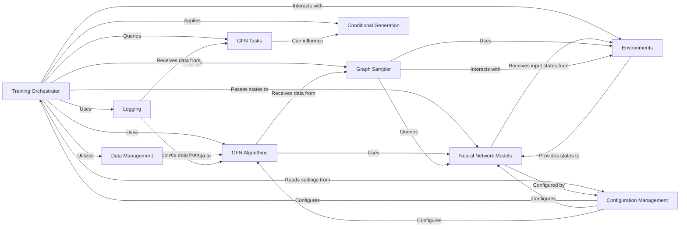

## Details

The Training Orchestrator is the central component responsible for managing and coordinating the entire GFlowNet training loop. It initializes and integrates various sub-components, including the GFlowNet algorithm, neural network models, generative environments, and data management systems. Its primary responsibilities include: Training Loop Management: Iteratively samples trajectories from the environment, computes losses based on the chosen GFlowNet algorithm, and updates the model parameters. Component Coordination: Ensures seamless interaction and data flow between the GFN Algorithms, Neural Network Models, Environments, GFN Tasks, and Data Management components. Optimization: Manages the optimization process, applying gradients to update the model's parameters. Logging and Monitoring: Integrates with logging utilities to record training progress, metrics, and other relevant information. Configuration Application: Reads and applies training parameters and configurations defined by the Configuration Management component.

### Training Orchestrator [[Expand]](./Training_Orchestrator.md)
Orchestrates the entire GFlowNet training process. It initializes and coordinates the interaction between algorithms, models, environments, and data to learn generative policies, managing the training loop, optimization, and logging.

**Related Classes/Methods**:

- <a href="https://github.com/recursionpharma/gflownet/blob/trunk/src/gflownet/trainer.py#L1-L1" target="_blank" rel="noopener noreferrer">`gflownet/trainer.py` (1:1)</a>
- <a href="https://github.com/recursionpharma/gflownet/blob/trunk/src/gflownet/online_trainer.py#L1-L1" target="_blank" rel="noopener noreferrer">`gflownet/online_trainer.py` (1:1)</a>

### GFN Algorithms
Implement the core GFlowNet learning rules and loss functions (e.g., Trajectory Balance, Flow Matching). They define how the model parameters are updated based on sampled trajectories and rewards.

**Related Classes/Methods**:

- <a href="https://github.com/recursionpharma/gflownet/blob/trunk/src/gflownet/algo/trajectory_balance.py#L1-L1" target="_blank" rel="noopener noreferrer">`gflownet/algo/trajectory_balance.py` (1:1)</a>
- <a href="https://github.com/recursionpharma/gflownet/blob/trunk/src/gflownet/algo/flow_matching.py#L1-L1" target="_blank" rel="noopener noreferrer">`gflownet/algo/flow_matching.py` (1:1)</a>
- <a href="https://github.com/recursionpharma/gflownet/blob/trunk/src/gflownet/algo/advantage_actor_critic.py#L1-L1" target="_blank" rel="noopener noreferrer">`gflownet/algo/advantage_actor_critic.py` (1:1)</a>
- <a href="https://github.com/recursionpharma/gflownet/blob/trunk/src/gflownet/algo/envelope_q_learning.py#L1-L1" target="_blank" rel="noopener noreferrer">`gflownet/algo/envelope_q_learning.py` (1:1)</a>
- <a href="https://github.com/recursionpharma/gflownet/blob/trunk/src/gflownet/algo/soft_q_learning.py#L1-L1" target="_blank" rel="noopener noreferrer">`gflownet/algo/soft_q_learning.py` (1:1)</a>

### Neural Network Models
Parameterized functions (e.g., Graph Transformers, Sequence Transformers) that represent the GFlowNet's policy. They learn to map states to actions or flow values, enabling the generation of structured data.

**Related Classes/Methods**:

- <a href="https://github.com/recursionpharma/gflownet/blob/trunk/src/gflownet/models/graph_transformer.py#L1-L1" target="_blank" rel="noopener noreferrer">`gflownet/models/graph_transformer.py` (1:1)</a>
- <a href="https://github.com/recursionpharma/gflownet/blob/trunk/src/gflownet/models/seq_transformer.py#L1-L1" target="_blank" rel="noopener noreferrer">`gflownet/models/seq_transformer.py` (1:1)</a>
- <a href="https://github.com/recursionpharma/gflownet/blob/trunk/src/gflownet/models/mxmnet.py#L1-L1" target="_blank" rel="noopener noreferrer">`gflownet/models/mxmnet.py` (1:1)</a>

### Environments
Define the problem space and the generative process. They provide the states, actions, and transitions that the GFlowNet learns to navigate and generate, representing the structured data (e.g., molecules, sequences).

**Related Classes/Methods**:

- <a href="https://github.com/recursionpharma/gflownet/blob/trunk/src/gflownet/envs/graph_building_env.py#L1-L1" target="_blank" rel="noopener noreferrer">`gflownet/envs/graph_building_env.py` (1:1)</a>
- <a href="https://github.com/recursionpharma/gflownet/blob/trunk/src/gflownet/envs/mol_building_env.py#L1-L1" target="_blank" rel="noopener noreferrer">`gflownet/envs/mol_building_env.py` (1:1)</a>
- <a href="https://github.com/recursionpharma/gflownet/blob/trunk/src/gflownet/envs/frag_mol_env.py#L1-L1" target="_blank" rel="noopener noreferrer">`gflownet/envs/frag_mol_env.py` (1:1)</a>
- <a href="https://github.com/recursionpharma/gflownet/blob/trunk/src/gflownet/envs/seq_building_env.py#L1-L1" target="_blank" rel="noopener noreferrer">`gflownet/envs/seq_building_env.py` (1:1)</a>

### GFN Tasks
Encapsulate the specific objective or reward function for a generative problem. They provide the crucial feedback signal that guides the GFlowNet's learning towards desired outcomes.

**Related Classes/Methods**:

- <a href="https://github.com/recursionpharma/gflownet/blob/trunk/src/gflownet/tasks/qm9.py#L1-L1" target="_blank" rel="noopener noreferrer">`gflownet/tasks/qm9.py` (1:1)</a>
- <a href="https://github.com/recursionpharma/gflownet/blob/trunk/src/gflownet/tasks/make_rings.py#L1-L1" target="_blank" rel="noopener noreferrer">`gflownet/tasks/make_rings.py` (1:1)</a>
- <a href="https://github.com/recursionpharma/gflownet/blob/trunk/src/gflownet/tasks/toy_seq.py#L1-L1" target="_blank" rel="noopener noreferrer">`gflownet/tasks/toy_seq.py` (1:1)</a>
- <a href="https://github.com/recursionpharma/gflownet/blob/trunk/src/gflownet/tasks/seh_frag.py#L1-L1" target="_blank" rel="noopener noreferrer">`gflownet/tasks/seh_frag.py` (1:1)</a>
- <a href="https://github.com/recursionpharma/gflownet/blob/trunk/src/gflownet/tasks/qm9_moo.py#L1-L1" target="_blank" rel="noopener noreferrer">`gflownet/tasks/qm9_moo.py` (1:1)</a>
- <a href="https://github.com/recursionpharma/gflownet/blob/trunk/src/gflownet/tasks/seh_frag_moo.py#L1-L1" target="_blank" rel="noopener noreferrer">`gflownet/tasks/seh_frag_moo.py` (1:1)</a>

### Configuration Management
Manages hyperparameters and settings across all components, ensuring reproducibility and facilitating experimentation. It provides a centralized way to define and load configurations for algorithms, models, environments, and training.

**Related Classes/Methods**:

- <a href="https://github.com/recursionpharma/gflownet/blob/trunk/src/gflownet/config.py#L1-L1" target="_blank" rel="noopener noreferrer">`gflownet/config.py` (1:1)</a>
- <a href="https://github.com/recursionpharma/gflownet/blob/trunk/src/gflownet/algo/config.py#L1-L1" target="_blank" rel="noopener noreferrer">`gflownet/algo/config.py` (1:1)</a>
- <a href="https://github.com/recursionpharma/gflownet/blob/trunk/src/gflownet/models/config.py#L1-L1" target="_blank" rel="noopener noreferrer">`gflownet/models/config.py` (1:1)</a>
- <a href="https://github.com/recursionpharma/gflownet/blob/trunk/src/gflownet/tasks/config.py#L1-L1" target="_blank" rel="noopener noreferrer">`gflownet/tasks/config.py` (1:1)</a>
- <a href="https://github.com/recursionpharma/gflownet/blob/trunk/src/gflownet/data/config.py#L1-L1" target="_blank" rel="noopener noreferrer">`gflownet/data/config.py` (1:1)</a>
- <a href="https://github.com/recursionpharma/gflownet/blob/trunk/src/gflownet/utils/config.py#L1-L1" target="_blank" rel="noopener noreferrer">`gflownet/utils/config.py` (1:1)</a>

### Data Management
Handles the storage, retrieval, and sampling of data, particularly trajectories generated during training. This includes replay buffers for off-policy learning and dataset handling.

**Related Classes/Methods**:

- <a href="https://github.com/recursionpharma/gflownet/blob/trunk/src/gflownet/data/replay_buffer.py#L1-L1" target="_blank" rel="noopener noreferrer">`gflownet/data/replay_buffer.py` (1:1)</a>
- <a href="https://github.com/recursionpharma/gflownet/blob/trunk/src/gflownet/data/data_source.py#L1-L1" target="_blank" rel="noopener noreferrer">`gflownet/data/data_source.py` (1:1)</a>
- <a href="https://github.com/recursionpharma/gflownet/blob/trunk/src/gflownet/data/qm9.py#L1-L1" target="_blank" rel="noopener noreferrer">`gflownet/data/qm9.py` (1:1)</a>

### Graph Sampler
Responsible for generating trajectories (sequences of states and actions) within the environment by interacting with the neural network models. It simulates the generative process of the GFlowNet.

**Related Classes/Methods**:

- <a href="https://github.com/recursionpharma/gflownet/blob/trunk/src/gflownet/algo/graph_sampling.py#L1-L1" target="_blank" rel="noopener noreferrer">`gflownet/algo/graph_sampling.py` (1:1)</a>

### Conditional Generation
Provides mechanisms to guide the GFlowNet's generative process based on specific conditions or preferences (e.g., temperature conditioning, multi-objective preferences, focus regions). This allows for targeted generation of desired outputs.

**Related Classes/Methods**:

- <a href="https://github.com/recursionpharma/gflownet/blob/trunk/src/gflownet/utils/conditioning.py#L1-L1" target="_blank" rel="noopener noreferrer">`gflownet/utils/conditioning.py` (1:1)</a>

### Logging
Manages the recording of training progress, metrics, and other relevant information to a persistent store (e.g., SQLite database). Essential for monitoring experiments, debugging, and analyzing results.

**Related Classes/Methods**:

- <a href="https://github.com/recursionpharma/gflownet/blob/trunk/src/gflownet/utils/sqlite_log.py#L1-L1" target="_blank" rel="noopener noreferrer">`gflownet/utils/sqlite_log.py` (1:1)</a>

### [FAQ](https://github.com/CodeBoarding/GeneratedOnBoardings/tree/main?tab=readme-ov-file#faq)