```mermaid
graph LR
    Configuration_Manager["Configuration Manager"]
    Training_Orchestrator["Training Orchestrator"]
    GFN_Algorithm_Implementations["GFN Algorithm Implementations"]
    Environment_Simulator["Environment Simulator"]
    Policy_Network["Policy Network"]
    Data_Manager["Data Manager"]
    Task_Specific_Logic["Task Specific Logic"]
    Conditional_Information_Handler["Conditional Information Handler"]
    Metrics_and_Evaluation["Metrics and Evaluation"]
    Core_Utilities["Core Utilities"]
    Configuration_Manager -- "Configures" --> Training_Orchestrator
    Training_Orchestrator -- "Drives Learning in" --> GFN_Algorithm_Implementations
    Training_Orchestrator -- "Manages Parameters of" --> Policy_Network
    Training_Orchestrator -- "Interacts with" --> Environment_Simulator
    Training_Orchestrator -- "Retrieves Data From" --> Data_Manager
    Training_Orchestrator -- "Utilizes" --> Task_Specific_Logic
    Training_Orchestrator -- "Utilizes" --> Conditional_Information_Handler
    Training_Orchestrator -- "Reports Metrics To" --> Metrics_and_Evaluation
    GFN_Algorithm_Implementations -- "Queries" --> Policy_Network
    GFN_Algorithm_Implementations -- "Interacts with" --> Environment_Simulator
    GFN_Algorithm_Implementations -- "Consumes Data From" --> Data_Manager
    GFN_Algorithm_Implementations -- "Uses Conditioning From" --> Conditional_Information_Handler
    GFN_Algorithm_Implementations -- "Receives Rewards From" --> Task_Specific_Logic
    Environment_Simulator -- "Provides States/Actions To" --> GFN_Algorithm_Implementations
    Environment_Simulator -- "Provides States/Actions To" --> Policy_Network
    Policy_Network -- "Receives Input From" --> Environment_Simulator
    Policy_Network -- "Receives Input From" --> Conditional_Information_Handler
    Policy_Network -- "Outputs Predictions To" --> GFN_Algorithm_Implementations
    Data_Manager -- "Provides Data To" --> Training_Orchestrator
    Data_Manager -- "Provides Data To" --> GFN_Algorithm_Implementations
    Task_Specific_Logic -- "Provides Rewards To" --> GFN_Algorithm_Implementations
    Task_Specific_Logic -- "Evaluates States From" --> Environment_Simulator
    Task_Specific_Logic -- "Uses Conditioning From" --> Conditional_Information_Handler
    Conditional_Information_Handler -- "Provides Conditioning To" --> Policy_Network
    Conditional_Information_Handler -- "Provides Conditioning To" --> GFN_Algorithm_Implementations
    Conditional_Information_Handler -- "Provides Conditioning To" --> Task_Specific_Logic
    Metrics_and_Evaluation -- "Receives Data From" --> Training_Orchestrator
    Metrics_and_Evaluation -- "Receives Data From" --> Task_Specific_Logic
    click Configuration_Manager href "https://github.com/CodeBoarding/GeneratedOnBoardings/blob/main/gflownet/Configuration_Manager.md" "Details"
    click Training_Orchestrator href "https://github.com/CodeBoarding/GeneratedOnBoardings/blob/main/gflownet/Training_Orchestrator.md" "Details"
    click GFN_Algorithm_Implementations href "https://github.com/CodeBoarding/GeneratedOnBoardings/blob/main/gflownet/GFN_Algorithm_Implementations.md" "Details"
    click Environment_Simulator href "https://github.com/CodeBoarding/GeneratedOnBoardings/blob/main/gflownet/Environment_Simulator.md" "Details"
    click Policy_Network href "https://github.com/CodeBoarding/GeneratedOnBoardings/blob/main/gflownet/Policy_Network.md" "Details"
    click Data_Manager href "https://github.com/CodeBoarding/GeneratedOnBoardings/blob/main/gflownet/Data_Manager.md" "Details"
    click Task_Specific_Logic href "https://github.com/CodeBoarding/GeneratedOnBoardings/blob/main/gflownet/Task_Specific_Logic.md" "Details"
    click Conditional_Information_Handler href "https://github.com/CodeBoarding/GeneratedOnBoardings/blob/main/gflownet/Conditional_Information_Handler.md" "Details"
    click Metrics_and_Evaluation href "https://github.com/CodeBoarding/GeneratedOnBoardings/blob/main/gflownet/Metrics_and_Evaluation.md" "Details"
```

## Details

The `gflownet` project is structured as a modular Machine Learning Framework for Generative Models of Structured Data (Graphs), exhibiting clear separation of concerns across its core components. The architecture facilitates the development and experimentation of GFlowNet algorithms by providing distinct modules for configuration, training orchestration, algorithm implementation, environment simulation, policy modeling, data management, task-specific logic, conditional guidance, and performance evaluation.

### Configuration Manager [[Expand]](./Configuration_Manager.md)
Centralized management of hyperparameters and configuration settings, defining the operational parameters for the entire GFlowNet framework. It ensures consistent setup across all modules.

**Related Classes/Methods**:

- <a href="https://github.com/recursionpharma/gflownet/blob/trunk/src/gflownet/config.py#L1-L1" target="_blank" rel="noopener noreferrer">`gflownet/config.py` (1:1)</a>
- <a href="https://github.com/recursionpharma/gflownet/blob/trunk/src/gflownet/algo/config.py#L1-L1" target="_blank" rel="noopener noreferrer">`gflownet/algo/config.py` (1:1)</a>
- <a href="https://github.com/recursionpharma/gflownet/blob/trunk/src/gflownet/models/config.py#L1-L1" target="_blank" rel="noopener noreferrer">`gflownet/models/config.py` (1:1)</a>
- <a href="https://github.com/recursionpharma/gflownet/blob/trunk/src/gflownet/data/config.py#L1-L1" target="_blank" rel="noopener noreferrer">`gflownet/data/config.py` (1:1)</a>
- <a href="https://github.com/recursionpharma/gflownet/blob/trunk/src/gflownet/tasks/config.py#L1-L1" target="_blank" rel="noopener noreferrer">`gflownet/tasks/config.py` (1:1)</a>
- <a href="https://github.com/recursionpharma/gflownet/blob/trunk/src/gflownet/utils/config.py#L1-L1" target="_blank" rel="noopener noreferrer">`gflownet/utils/config.py` (1:1)</a>

### Training Orchestrator [[Expand]](./Training_Orchestrator.md)
Orchestrates the entire GFlowNet training process. It initializes and coordinates the interaction between algorithms, models, environments, and data to learn generative policies, managing the training loop, optimization, and logging.

**Related Classes/Methods**:

- <a href="https://github.com/recursionpharma/gflownet/blob/trunk/src/gflownet/trainer.py#L1-L1" target="_blank" rel="noopener noreferrer">`gflownet/trainer.py` (1:1)</a>
- <a href="https://github.com/recursionpharma/gflownet/blob/trunk/src/gflownet/online_trainer.py#L1-L1" target="_blank" rel="noopener noreferrer">`gflownet/online_trainer.py` (1:1)</a>

### GFN Algorithm Implementations [[Expand]](./GFN_Algorithm_Implementations.md)
Implements the core GFlowNet learning algorithms (e.g., Trajectory Balance, Flow Matching). These components define the specific loss functions and learning rules that guide the policy optimization based on collected trajectories.

**Related Classes/Methods**:

- `gflownet/algo/*.py` (1:1)

### Environment Simulator [[Expand]](./Environment_Simulator.md)
Defines the state space, valid actions, and transition dynamics for building structured data (graphs, molecules, sequences). It simulates the generative process, allowing the GFlowNet to explore and construct data instances step-by-step.

**Related Classes/Methods**:

- `gflownet/envs/*.py` (1:1)

### Policy Network [[Expand]](./Policy_Network.md)
Implements the neural network architectures (e.g., Graph Transformers, MXMNet, Sequence Transformers) that represent the GFlowNet policy. It takes the current environment state and conditional information as input and outputs predictions (e.g., action probabilities, state values) to guide the generative process.

**Related Classes/Methods**:

- `gflownet/models/*.py` (1:1)

### Data Manager [[Expand]](./Data_Manager.md)
Handles the loading, sampling, and storage of data. This includes managing initial datasets (e.g., QM9) and maintaining replay buffers for experience replay, which are crucial for off-policy learning in GFlowNets.

**Related Classes/Methods**:

- `gflownet/data/*.py` (1:1)
- `gflownet/tasks/*.py` (1:1)

### Task Specific Logic [[Expand]](./Task_Specific_Logic.md)
Defines the specific objectives and reward functions for different GFlowNet applications (e.g., QM9 property prediction, molecule generation, sequence generation). It encapsulates the problem-specific evaluation of generated data and provides reward signals to the learning algorithms.

**Related Classes/Methods**:

- `gflownet/tasks/*.py` (1:1)

### Conditional Information Handler [[Expand]](./Conditional_Information_Handler.md)
Generates, encodes, and transforms conditional information (e.g., temperature, multi-objective preferences, focus regions) that guides the GFlowNet's generative process. This allows for controlled and targeted generation of structured data.

**Related Classes/Methods**:

- <a href="https://github.com/recursionpharma/gflownet/blob/trunk/src/gflownet/utils/conditioning.py#L1-L1" target="_blank" rel="noopener noreferrer">`gflownet/utils/conditioning.py` (1:1)</a>
- <a href="https://github.com/recursionpharma/gflownet/blob/trunk/src/gflownet/utils/focus_model.py#L1-L1" target="_blank" rel="noopener noreferrer">`gflownet/utils/focus_model.py` (1:1)</a>

### Metrics and Evaluation [[Expand]](./Metrics_and_Evaluation.md)
Computes and tracks various performance metrics, especially for multi-objective optimization (e.g., Hypervolume, IGD, HSR). It integrates with logging mechanisms to monitor training progress, evaluate model performance, and provide insights into the generative process.

**Related Classes/Methods**:

- <a href="https://github.com/recursionpharma/gflownet/blob/trunk/src/gflownet/utils/metrics.py#L1-L1" target="_blank" rel="noopener noreferrer">`gflownet/utils/metrics.py` (1:1)</a>
- <a href="https://github.com/recursionpharma/gflownet/blob/trunk/src/gflownet/utils/multiobjective_hooks.py#L1-L1" target="_blank" rel="noopener noreferrer">`gflownet/utils/multiobjective_hooks.py` (1:1)</a>

### Core Utilities
Provides a collection of general-purpose helper functions and foundational classes that support operations across the entire framework. This includes device management, random number generation, data transformations, multiprocessing wrappers, and basic logging functionalities.

**Related Classes/Methods**:

- <a href="https://github.com/recursionpharma/gflownet/blob/trunk/src/gflownet/utils/misc.py#L1-L1" target="_blank" rel="noopener noreferrer">`gflownet/utils/misc.py` (1:1)</a>
- <a href="https://github.com/recursionpharma/gflownet/blob/trunk/src/gflownet/utils/transforms.py#L1-L1" target="_blank" rel="noopener noreferrer">`gflownet/utils/transforms.py` (1:1)</a>
- <a href="https://github.com/recursionpharma/gflownet/blob/trunk/src/gflownet/utils/sqlite_log.py#L1-L1" target="_blank" rel="noopener noreferrer">`gflownet/utils/sqlite_log.py` (1:1)</a>
- <a href="https://github.com/recursionpharma/gflownet/blob/trunk/src/gflownet/utils/multiprocessing_proxy.py#L1-L1" target="_blank" rel="noopener noreferrer">`gflownet/utils/multiprocessing_proxy.py` (1:1)</a>

### [FAQ](https://github.com/CodeBoarding/GeneratedOnBoardings/tree/main?tab=readme-ov-file#faq)