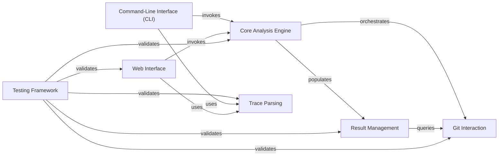

## Details

One paragraph explaining the functionality which is represented by this graph. What the main flow is and what is its purpose.

### Core Analysis Engine [[Expand]](./Core_Analysis_Engine.md)
The central orchestrator for stacktrace lookup and analysis. It coordinates interactions with the Git Interaction and Traceback Parsing modules and populates the Result Management module. It provides the main entry points for the application's core logic.

**Related Classes/Methods**:

- <a href="https://github.com/pinterest/git-stacktrace/blob/master/git_stacktrace/api.py#L1-L10000" target="_blank" rel="noopener noreferrer">`git_stacktrace.api` (1:10000)</a>

### Git Interaction
Responsible for all interactions with the Git version control system. This includes retrieving file information, commit history, performing line-specific lookups (e.g., git blame or git pickaxe), and converting Git-specific time formats.

**Related Classes/Methods**:

- <a href="https://github.com/pinterest/git-stacktrace/blob/master/git_stacktrace/git.py#L1-L10000" target="_blank" rel="noopener noreferrer">`git_stacktrace.git` (1:10000)</a>

### Trace Parsing
Specializes in parsing raw stack trace text from various programming languages into a structured, programmatic format. It defines a class hierarchy to handle different trace formats (e.g., Python, Java, JavaScript).

**Related Classes/Methods**:

- <a href="https://github.com/pinterest/git-stacktrace/blob/master/git_stacktrace/parse_trace.py#L1-L10000" target="_blank" rel="noopener noreferrer">`git_stacktrace.parse_trace` (1:10000)</a>

### Result Management
Manages, stores, and provides access to the structured results of the stack trace analysis. It aggregates information, linking parsed stack trace lines with relevant Git commits, files, and authors.

**Related Classes/Methods**:

- <a href="https://github.com/pinterest/git-stacktrace/blob/master/git_stacktrace/result.py#L1-L10000" target="_blank" rel="noopener noreferrer">`git_stacktrace.result` (1:10000)</a>

### Command-Line Interface (CLI)
Provides the primary command-line interface for users to interact with the `git-stacktrace` tool. It handles argument parsing, input validation, and orchestrates calls to the Core Analysis Engine based on user commands.

**Related Classes/Methods**:

- <a href="https://github.com/pinterest/git-stacktrace/blob/master/git_stacktrace/cmd.py#L1-L10000" target="_blank" rel="noopener noreferrer">`git_stacktrace.cmd` (1:10000)</a>

### Web Interface
Implements a web server (using Flask/FastAPI) to offer a graphical user interface or RESTful API endpoints for the `git-stacktrace` functionality. It handles web requests and renders HTML templates for user interaction.

**Related Classes/Methods**:

- <a href="https://github.com/pinterest/git-stacktrace/blob/master/git_stacktrace/server.py#L1-L10000" target="_blank" rel="noopener noreferrer">`git_stacktrace.server` (1:10000)</a>
- `git_stacktrace.templates` (1:10000)

### Testing Framework
Contains a comprehensive suite of unit and integration tests for all other components of the `git-stacktrace` application. These tests ensure the correctness, reliability, and performance of the entire system.

**Related Classes/Methods**:

- `git_stacktrace.tests` (1:10000)

### [FAQ](https://github.com/CodeBoarding/GeneratedOnBoardings/tree/main?tab=readme-ov-file#faq)