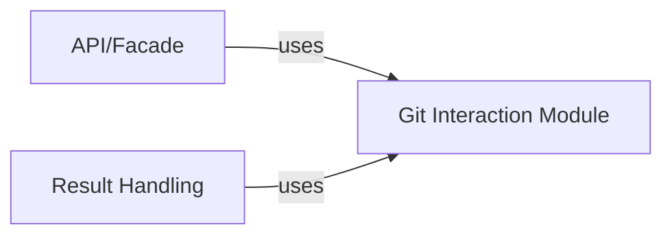

## Details

One paragraph explaining the functionality which is represented by this graph. What the main flow is and what is its purpose.

### Git Interaction Module [[Expand]](./Git_Interaction_Module.md)
This module provides a comprehensive set of functionalities for interacting with the Git version control system. It handles the execution of Git commands, processes their output, and extracts various types of information such as commit details, file changes, and line-level modifications. It acts as a low-level interface to Git, abstracting away the complexities of command-line execution and output parsing.

**Related Classes/Methods**:

- <a href="https://github.com/pinterest/git-stacktrace/blob/master/git_stacktrace/git.py#L1-L99999" target="_blank" rel="noopener noreferrer">`git_stacktrace.git` (1:99999)</a>

### API/Facade
The API/Facade component orchestrates core application logic and directly consumes functionalities from the Git Interaction Module to retrieve Git-related information.

**Related Classes/Methods**:

- <a href="https://github.com/pinterest/git-stacktrace/blob/master/git_stacktrace/api.py#L1-L99999" target="_blank" rel="noopener noreferrer">`git_stacktrace.api` (1:99999)</a>

### Result Handling
The Result Handling component utilizes the Git Interaction Module to enrich the parsed stack trace data with Git-specific information, such as commit details and file changes.

**Related Classes/Methods**:

- <a href="https://github.com/pinterest/git-stacktrace/blob/master/git_stacktrace/result.py#L1-L99999" target="_blank" rel="noopener noreferrer">`git_stacktrace.result` (1:99999)</a>

### [FAQ](https://github.com/CodeBoarding/GeneratedOnBoardings/tree/main?tab=readme-ov-file#faq)