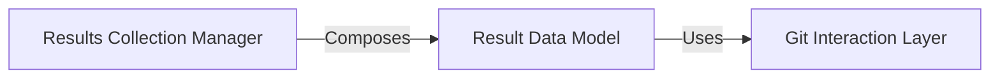

## Details

The `Result Management Module` is central to `git_stacktrace` as it defines and manages the core data structures for representing analysis outcomes. It ensures that the results of Git commit analysis are well-defined, efficiently managed, and easily accessible.

### Result Data Model
This component defines the structure and behavior of a single Git commit analysis result. It encapsulates various properties of a commit, such as its summary, subject, body, author, date, and URL. A key feature is its lazy-loading mechanism (`_lazy_fetch`), which efficiently retrieves detailed commit information from Git only when it's explicitly accessed. It also defines how individual results are compared (`__lt__`) and formatted for display (`__str__`). This component is fundamental because it provides the atomic unit for representing the analysis output, ensuring data consistency and efficient retrieval of commit details.

**Related Classes/Methods**:

- <a href="https://github.com/pinterest/git-stacktrace/blob/master/git_stacktrace/result.py#L3-L140" target="_blank" rel="noopener noreferrer">`git_stacktrace.result.Result` (3:140)</a>

### Results Collection Manager
This component is responsible for managing a collection of `Result` objects. It provides methods to create new `Result` instances (`get_result`) and to retrieve sorted collections of results (`get_sorted_results_by_dict`, `get_sorted_results`). It acts as a container and orchestrator for multiple individual commit results, enabling aggregation and organized access to the analysis output. This component is fundamental as it allows the system to handle multiple analysis results cohesively, providing mechanisms for sorting and retrieval, which is crucial for presenting a comprehensive view of the analysis.

**Related Classes/Methods**:

- <a href="https://github.com/pinterest/git-stacktrace/blob/master/git_stacktrace/result.py#L143-L162" target="_blank" rel="noopener noreferrer">`git_stacktrace.result.Results` (143:162)</a>

### Git Interaction Layer
An assumed component responsible for direct Git operations.

**Related Classes/Methods**: _None_

### [FAQ](https://github.com/CodeBoarding/GeneratedOnBoardings/tree/main?tab=readme-ov-file#faq)