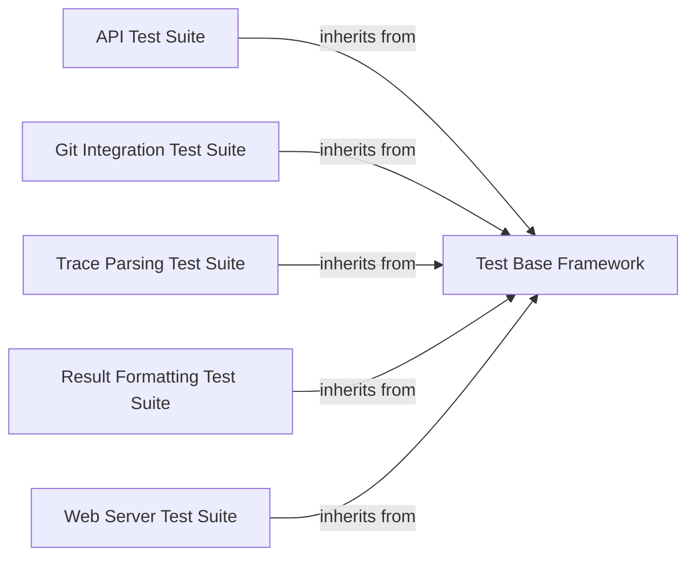

## Details

The `Testing Suite` component is crucial for ensuring the reliability and correctness of the `git_stacktrace` project. It adheres to developer tool patterns by providing a robust and modular testing framework.

### Test Base Framework
This component provides the foundational base class (`TestCase`) for all unit and integration tests within the project. It encapsulates common setup, teardown, and assertion utilities, promoting code reuse and consistency across all test suites.

**Related Classes/Methods**:

- <a href="https://github.com/pinterest/git-stacktrace/blob/master/git_stacktrace/tests/base.py#L1-L1" target="_blank" rel="noopener noreferrer">`git_stacktrace.tests.base` (1:1)</a>

### API Test Suite
This suite contains specific tests designed to validate the functionality and correctness of the `git_stacktrace` API endpoints. It ensures that the API behaves as expected, handling various requests and returning appropriate responses.

**Related Classes/Methods**:

- <a href="https://github.com/pinterest/git-stacktrace/blob/master/git_stacktrace/tests/test_api.py#L1-L1" target="_blank" rel="noopener noreferrer">`git_stacktrace.tests.test_api` (1:1)</a>

### Git Integration Test Suite
This component focuses on testing the interactions with Git repositories. It verifies operations such as retrieving file content, commit information, and diffs, ensuring the tool accurately extracts data from Git.

**Related Classes/Methods**:

- <a href="https://github.com/pinterest/git-stacktrace/blob/master/git_stacktrace/tests/test_git.py#L1-L1" target="_blank" rel="noopener noreferrer">`git_stacktrace.tests.test_git` (1:1)</a>

### Trace Parsing Test Suite
This suite validates the logic responsible for parsing various types of stack traces (e.g., Python, Java, JavaScript) and accurately extracting relevant information like file paths, line numbers, and function names.

**Related Classes/Methods**:

- <a href="https://github.com/pinterest/git-stacktrace/blob/master/git_stacktrace/tests/test_parse_trace.py#L1-L1" target="_blank" rel="noopener noreferrer">`git_stacktrace.tests.test_parse_trace` (1:1)</a>

### Result Formatting Test Suite
This component tests the modules responsible for formatting and presenting the analyzed stack trace results. It ensures the output is user-friendly, consistent, and contains all necessary information.

**Related Classes/Methods**:

- <a href="https://github.com/pinterest/git-stacktrace/blob/master/git_stacktrace/tests/test_result.py#L1-L1" target="_blank" rel="noopener noreferrer">`git_stacktrace.tests.test_result` (1:1)</a>

### Web Server Test Suite
This suite contains tests for the web server component, ensuring its stability, correct routing, and proper handling of web requests and responses, particularly for any web-based interface or API.

**Related Classes/Methods**:

- <a href="https://github.com/pinterest/git-stacktrace/blob/master/git_stacktrace/tests/test_server.py#L1-L1" target="_blank" rel="noopener noreferrer">`git_stacktrace.tests.test_server` (1:1)</a>

### [FAQ](https://github.com/CodeBoarding/GeneratedOnBoardings/tree/main?tab=readme-ov-file#faq)