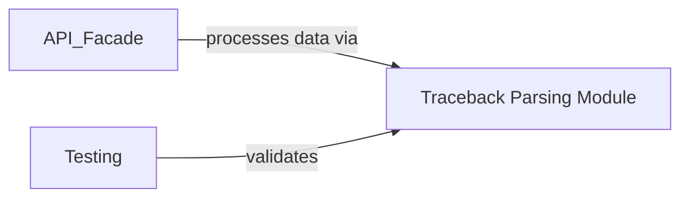

## Details

This module is fundamental because it acts as the initial data ingestion and transformation layer. Without the ability to accurately parse and structure raw stack traces, the `git-stacktrace` tool would be unable to perform any meaningful analysis, linking, or presentation of the debugging information. It provides the foundational data structure upon which all subsequent operations (like Git interaction and result handling) depend.

### Traceback Parsing Module [[Expand]](./Traceback_Parsing_Module.md)
This module is responsible for parsing raw stack trace text from various programming languages (e.g., Python, Java, JavaScript) into a structured, programmatic representation. It employs a class hierarchy with a base `Traceback` class and language-specific subclasses (`PythonTraceback`, `JavaTraceback`, `JavaScriptTraceback`) to handle diverse trace formats, extracting crucial information like file paths, line numbers, and function names.

**Related Classes/Methods**:

- <a href="https://github.com/pinterest/git-stacktrace/blob/master/git_stacktrace/parse_trace.py#L1-L1" target="_blank" rel="noopener noreferrer">`git_stacktrace.parse_trace` (1:1)</a>

### [FAQ](https://github.com/CodeBoarding/GeneratedOnBoardings/tree/main?tab=readme-ov-file#faq)