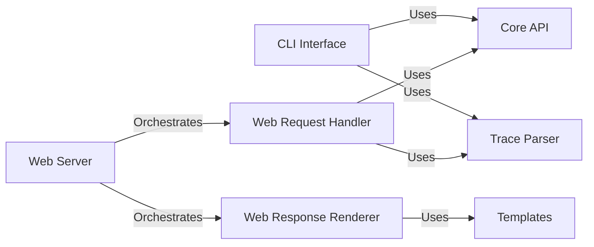

## Details

Abstract Components Overview

### CLI Interface
This component provides the command-line interface for git-stacktrace. It is responsible for parsing command-line arguments, orchestrating the execution flow by invoking core logic components, and presenting the final analysis results directly to the user via the console. It acts as a direct entry point for users preferring command-line interaction.

**Related Classes/Methods**:

- <a href="https://github.com/pinterest/git-stacktrace/blob/master/git_stacktrace/cmd.py#L1-L1" target="_blank" rel="noopener noreferrer">`git_stacktrace.cmd` (1:1)</a>

### Web Server
This component represents the main HTTP server application for the web interface. It is responsible for listening for incoming HTTP requests (GET and POST), managing the web application lifecycle, and dispatching requests to the appropriate internal handlers for processing.

**Related Classes/Methods**:

- <a href="https://github.com/pinterest/git-stacktrace/blob/master/git_stacktrace/server.py#L1-L1" target="_blank" rel="noopener noreferrer">`git_stacktrace.server` (1:1)</a>

### Web Request Handler
This component is dedicated to parsing and validating input parameters received via HTTP requests (e.g., query string parameters for GET requests, JSON bodies for POST requests) for the web interface. After successful validation, it initiates calls to the Core API and Trace Parser to perform the stacktrace analysis.

**Related Classes/Methods**:

- <a href="https://github.com/pinterest/git-stacktrace/blob/master/git_stacktrace/server.py#L1-L1" target="_blank" rel="noopener noreferrer">`git_stacktrace.server` (1:1)</a>

### Web Response Renderer
This component is responsible for formatting and rendering the processed stacktrace analysis results into appropriate web-friendly formats, such as HTML pages or JSON responses, for the web interface. It leverages HTML templates for structured and consistent output.

**Related Classes/Methods**:

- <a href="https://github.com/pinterest/git-stacktrace/blob/master/git_stacktrace/server.py#L1-L1" target="_blank" rel="noopener noreferrer">`git_stacktrace.server` (1:1)</a>

### Templates
This component consists of HTML template files that define the structure and presentation of the web interface. These templates are utilized by the Web Response Renderer to dynamically construct web responses based on the processed data.

**Related Classes/Methods**: _None_

### Core API
Core API component (details not provided in the input).

**Related Classes/Methods**: _None_

### Trace Parser
Trace Parser component (details not provided in the input).

**Related Classes/Methods**: _None_

### [FAQ](https://github.com/CodeBoarding/GeneratedOnBoardings/tree/main?tab=readme-ov-file#faq)