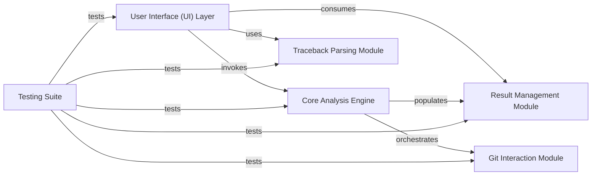

## Details

One paragraph explaining the functionality which is represented by this graph. What the main flow is and what is its purpose.

### User Interface (UI) Layer [[Expand]](./User_Interface_UI_Layer.md)
Provides the primary entry points for users, handling command-line arguments or web requests and presenting the processed stacktrace analysis results.

**Related Classes/Methods**:

- <a href="https://github.com/pinterest/git-stacktrace/blob/master/git_stacktrace/cmd.py#L1-L1" target="_blank" rel="noopener noreferrer">`git_stacktrace.cmd` (1:1)</a>
- <a href="https://github.com/pinterest/git-stacktrace/blob/master/git_stacktrace/server.py#L1-L1" target="_blank" rel="noopener noreferrer">`git_stacktrace.server` (1:1)</a>

### Core Analysis Engine [[Expand]](./Core_Analysis_Engine.md)
The central orchestrator for stacktrace lookup and analysis. It coordinates interactions with the Git Interaction and Traceback Parsing modules and populates the Result Management module.

**Related Classes/Methods**:

- <a href="https://github.com/pinterest/git-stacktrace/blob/master/git_stacktrace/api.py#L1-L1" target="_blank" rel="noopener noreferrer">`git_stacktrace.api` (1:1)</a>

### Git Interaction Module [[Expand]](./Git_Interaction_Module.md)
Encapsulates all interactions with the Git version control system, executing commands, parsing output, and retrieving commit, file, and line-level information.

**Related Classes/Methods**:

- <a href="https://github.com/pinterest/git-stacktrace/blob/master/git_stacktrace/git.py#L1-L1" target="_blank" rel="noopener noreferrer">`git_stacktrace.git` (1:1)</a>

### Traceback Parsing Module [[Expand]](./Traceback_Parsing_Module.md)
Responsible for parsing raw stacktrace text from various programming languages into a structured, programmatic representation.

**Related Classes/Methods**:

- <a href="https://github.com/pinterest/git-stacktrace/blob/master/git_stacktrace/parse_trace.py#L1-L1" target="_blank" rel="noopener noreferrer">`git_stacktrace.parse_trace` (1:1)</a>

### Result Management Module [[Expand]](./Result_Management_Module.md)
Defines and manages the data structures for representing the analysis results, including individual Result objects and Results collections, handling aggregation and sorting.

**Related Classes/Methods**:

- <a href="https://github.com/pinterest/git-stacktrace/blob/master/git_stacktrace/result.py#L1-L1" target="_blank" rel="noopener noreferrer">`git_stacktrace.result` (1:1)</a>

### Testing Suite [[Expand]](./Testing_Suite.md)
Provides the foundational framework and base classes for unit and integration tests, ensuring the reliability, correctness, and maintainability of the other functional modules.

**Related Classes/Methods**:

- `git_stacktrace.tests` (1:1)

### [FAQ](https://github.com/CodeBoarding/GeneratedOnBoardings/tree/main?tab=readme-ov-file#faq)