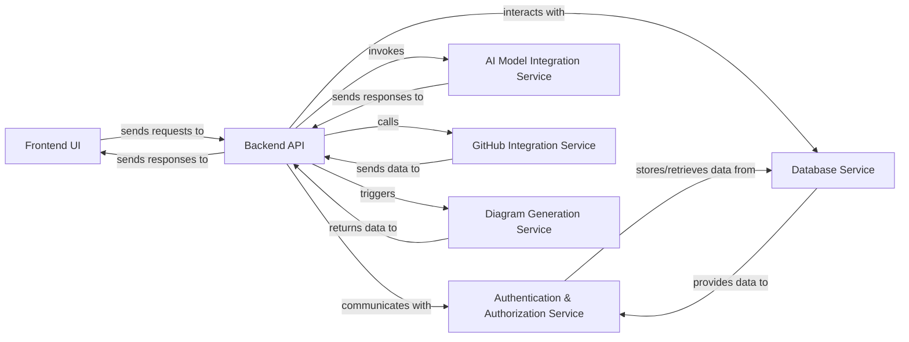

## Details

AI-powered SaaS Web Application / Developer Tool with AI Integration

### Frontend UI
Provides the interactive user interface and experience, handling all client-side logic, data presentation, and user input. It is built using Next.js, TypeScript, Tailwind CSS, and ShadCN.

**Related Classes/Methods**:

- `app/` (1:1)
- `components/ui/` (1:1)

### Backend API
Serves as the central application logic layer, exposing API endpoints for the Frontend UI and orchestrating interactions with other internal services. It processes business logic, handles data flow, and manages external integrations. Implemented with FastAPI and Python, potentially leveraging Server Actions.

**Related Classes/Methods**:

- `api/` (1:1)
- `backend/` (1:1)
- `app/api/` (1:1)

### Authentication & Authorization Service [[Expand]](./Authentication_Authorization_Service.md)
Manages user identity, including registration, login, session management, and logout. It also handles access control, ensuring users have appropriate permissions to access specific application features and data.

**Related Classes/Methods**:

- `app.auth.login` (1:1)
- `app.auth.logout` (1:1)
- `app.auth.authorize` (1:1)

### Database Service
Provides robust and persistent data storage for the entire application. This includes user profiles, project configurations, generated diagrams, and any other operational data. It utilizes PostgreSQL and Drizzle ORM for data management.

**Related Classes/Methods**:

- `db/schema.py` (1:1)
- `db/client.py` (1:1)

### AI Model Integration Service
Encapsulates all logic related to interacting with external AI models, specifically OpenAI o4-mini. This includes preparing prompts, sending requests to the AI API, and processing the generated responses for use within the application.

**Related Classes/Methods**:

- `ai/openai_client.py` (1:1)

### GitHub Integration Service [[Expand]](./GitHub_Integration_Service.md)
Manages all communication and data exchange with the GitHub API. This enables the developer tool to access user repositories, read code, and potentially perform actions on GitHub, crucial for its functionality as a developer tool.

**Related Classes/Methods**:

- `github/` (1:1)
- `integrations/github.py` (1:1)

### Diagram Generation Service
Contains the specialized business logic responsible for transforming various inputs (e.g., code structures, data models, user specifications) into visual diagrams. This is the unique and core functionality of the developer tool.

**Related Classes/Methods**:

- `diagram_generator/` (1:1)
- `core/diagram.py` (1:1)

### [FAQ](https://github.com/CodeBoarding/GeneratedOnBoardings/tree/main?tab=readme-ov-file#faq)