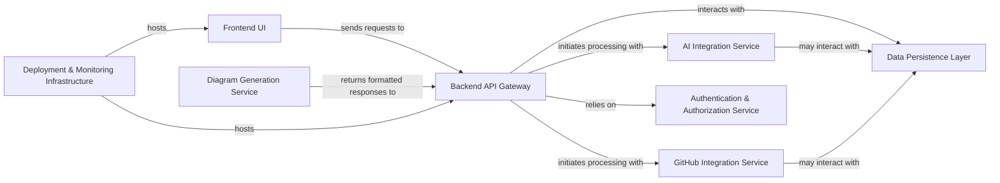

## Details

The feedback highlights a lack of specific source code references for several components. I will address this by identifying the most relevant Python modules or files for each component based on the provided file structure and common architectural patterns.

### Frontend UI
The client-side application built with Next.js, TypeScript, Tailwind CSS, and ShadCN. It provides the user interface for interacting with the application, displaying diagrams, and managing user input. As a Next.js application, its source code is primarily in TypeScript/JavaScript, not Python.

**Related Classes/Methods**: _None_

### Backend API Gateway [[Expand]](./Backend_API_Gateway.md)
The central server-side component built with FastAPI that acts as the entry point for all frontend requests. It orchestrates business logic, routes requests to internal services, handles CORS, and applies rate limiting.

**Related Classes/Methods**:

- `backend.app.main`

### AI Integration Service
Responsible for all AI interpretation and processing tasks. It interfaces with external AI models (e.g., OpenAI o4-mini) to generate insights or transform data as required by the application's core AI features.

**Related Classes/Methods**:

- `backend.app.services.claude_service`
- `backend.app.services.o1_mini_openai_service`
- `backend.app.services.o3_mini_openai_service`
- `backend.app.services.o3_mini_openrouter_service`
- `backend.app.services.o4_mini_openai_service`

### GitHub Integration Service [[Expand]](./GitHub_Integration_Service.md)
Manages all interactions with the GitHub API. This service is responsible for fetching repository data, code, and other relevant information required for diagram generation or analysis.

**Related Classes/Methods**:

- <a href="https://github.com/ahmedkhaleel2004/gitdiagram/blob/main/backend/app/services/github_service.py#L1-L1" target="_blank" rel="noopener noreferrer">`backend.app.services.github_service` (1:1)</a>

### Diagram Generation Service
Processes raw data and formats it into structured responses suitable for diagram visualization. This service translates internal data representations into a format consumable by the frontend's diagramming capabilities.

**Related Classes/Methods**:

- <a href="https://github.com/ahmedkhaleel2004/gitdiagram/blob/main/backend/app/routers/generate.py#L1-L1" target="_blank" rel="noopener noreferrer">`backend.app.routers.generate` (1:1)</a>
- <a href="https://github.com/ahmedkhaleel2004/gitdiagram/blob/main/backend/app/routers/modify.py#L33-L81" target="_blank" rel="noopener noreferrer">`backend.app.routers.modify` (33:81)</a>
- `backend.app.prompts`

### Data Persistence Layer
Manages all application data storage and retrieval. Utilizes PostgreSQL and Drizzle ORM to provide a robust and scalable database solution for user data, project configurations, and generated artifacts. Its implementation is distributed across various backend services and routers that interact with the database.

**Related Classes/Methods**: _None_

### Authentication & Authorization Service [[Expand]](./Authentication_Authorization_Service.md)
Handles user authentication, session management, and authorization logic. Ensures secure access to application features and data, likely managing user tokens and roles. This functionality is likely integrated within the `Backend API Gateway` (`backend.app.main`) and relevant routers.

**Related Classes/Methods**: _None_

### Deployment & Monitoring Infrastructure
Encompasses the tools and services for deploying, hosting, and monitoring the application. This includes Vercel for frontend, EC2 for backend, GitHub Actions for CI/CD, and PostHog/Api-Analytics for observability. This component primarily involves infrastructure configuration and CI/CD scripts (e.g., `.github/workflows/deploy.yml`, `backend/deploy.sh`) rather than application-level Python source code.

**Related Classes/Methods**: _None_

### [FAQ](https://github.com/CodeBoarding/GeneratedOnBoardings/tree/main?tab=readme-ov-file#faq)