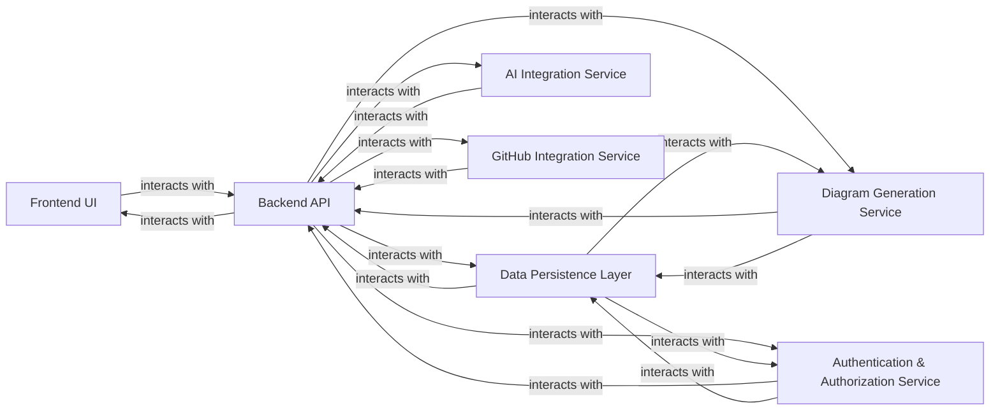

## Details

One paragraph explaining the functionality which is represented by this graph. What the main flow is and what is its purpose.

### Frontend UI
Provides the interactive user interface for the web application. It handles user input, displays generated diagrams, and communicates with the Backend API to fetch and send data.

**Related Classes/Methods**:

- `src/app/[username]/[repo]/page.tsx` (1:1)

### Backend API
Serves as the central application programming interface, orchestrating requests from the Frontend UI and coordinating operations across various backend services. It acts as the primary entry point for server-side logic.

**Related Classes/Methods**:

- <a href="https://github.com/ahmedkhaleel2004/gitdiagram/blob/main/backend/app/main.py#L1-L1" target="_blank" rel="noopener noreferrer">`backend/app/main.py` (1:1)</a>

### Data Persistence Layer
Manages all persistent data storage and retrieval operations for the application. This includes user profiles, diagram configurations, generated diagram outputs, and other application-specific data, primarily using PostgreSQL via Drizzle ORM.

**Related Classes/Methods**:

- `drizzle.config.ts` (1:1)

### AI Integration Service
Encapsulates the logic for interacting with external AI models (e.g., OpenAI o4-mini). It processes natural language inputs from users or the Backend API and returns AI-driven suggestions or content relevant to diagram creation.

**Related Classes/Methods**:

- <a href="https://github.com/ahmedkhaleel2004/gitdiagram/blob/main/backend/app/services/o4_mini_openai_service.py#L1-L1" target="_blank" rel="noopener noreferrer">`backend/app/services/o4_mini_openai_service.py` (1:1)</a>

### Diagram Generation Service
Contains the core business logic responsible for processing user inputs and AI outputs to construct, render, and generate various types of diagrams. It leverages data from the Data Persistence Layer for configurations and stores generated outputs.

**Related Classes/Methods**:

- <a href="https://github.com/ahmedkhaleel2004/gitdiagram/blob/main/backend/app/routers/generate.py#L1-L1" target="_blank" rel="noopener noreferrer">`backend/app/routers/generate.py` (1:1)</a>
- `backend/app/routers/modify.py`

### Authentication & Authorization Service [[Expand]](./Authentication_Authorization_Service.md)
Manages user authentication (login, registration, session management) and enforces authorization policies, ensuring that users have appropriate access to application features and data.

**Related Classes/Methods**:

- <a href="https://github.com/ahmedkhaleel2004/gitdiagram/blob/main/backend/app/main.py#L1-L1" target="_blank" rel="noopener noreferrer">`backend/app/main.py` (1:1)</a>

### GitHub Integration Service [[Expand]](./GitHub_Integration_Service.md)
Handles all interactions with the GitHub API, enabling functionalities suchs as fetching repository information, committing generated diagrams directly to repositories, and managing webhooks for repository events.

**Related Classes/Methods**:

- <a href="https://github.com/ahmedkhaleel2004/gitdiagram/blob/main/backend/app/services/github_service.py#L1-L1" target="_blank" rel="noopener noreferrer">`backend/app/services/github_service.py` (1:1)</a>

### [FAQ](https://github.com/CodeBoarding/GeneratedOnBoardings/tree/main?tab=readme-ov-file#faq)