```mermaid
graph LR
    Frontend_UI["Frontend UI"]
    Backend_API_Gateway["Backend API Gateway"]
    Authentication_Authorization_Service["Authentication & Authorization Service"]
    Git_Data_Processor["Git Data Processor"]
    AI_Integration_Service["AI Integration Service"]
    Diagram_Generation_Engine["Diagram Generation Engine"]
    Diagram_Persistence_Service["Diagram Persistence Service"]
    Database["Database"]
    Frontend_UI -- "sends requests to" --> Backend_API_Gateway
    Backend_API_Gateway -- "sends data to" --> Frontend_UI
    Backend_API_Gateway -- "forwards requests to" --> Git_Data_Processor
    Backend_API_Gateway -- "forwards requests to" --> Diagram_Generation_Engine
    Backend_API_Gateway -- "interacts with" --> Authentication_Authorization_Service
    Authentication_Authorization_Service -- "validates requests for" --> Backend_API_Gateway
    Authentication_Authorization_Service -- "authenticates requests from" --> Frontend_UI
    Git_Data_Processor -- "provides data to" --> Diagram_Generation_Engine
    Diagram_Generation_Engine -- "sends data to" --> AI_Integration_Service
    AI_Integration_Service -- "returns data to" --> Diagram_Generation_Engine
    Diagram_Generation_Engine -- "sends data to" --> Diagram_Persistence_Service
    Diagram_Persistence_Service -- "stores data in" --> Database
    Diagram_Persistence_Service -- "retrieves data from" --> Database
    click Backend_API_Gateway href "https://github.com/CodeBoarding/GeneratedOnBoardings/blob/main/gitdiagram/Backend_API_Gateway.md" "Details"
    click Authentication_Authorization_Service href "https://github.com/CodeBoarding/GeneratedOnBoardings/blob/main/gitdiagram/Authentication_Authorization_Service.md" "Details"
    click Diagram_Generation_Engine href "https://github.com/CodeBoarding/GeneratedOnBoardings/blob/main/gitdiagram/Diagram_Generation_Engine.md" "Details"
```

## Details

One paragraph explaining the functionality which is represented by this graph. What the main flow is and what is its purpose.

### Frontend UI
The client-side application responsible for user interaction, displaying generated diagrams, and initiating requests to the backend. It provides the visual interface for the developer tool.

**Related Classes/Methods**:

- `frontend.pages.index` (1:100)
- `frontend.components.DiagramViewer` (1:100)

### Backend API Gateway [[Expand]](./Backend_API_Gateway.md)
The central entry point for all client-side requests, responsible for routing requests to appropriate backend services, handling initial validation, and orchestrating responses.

**Related Classes/Methods**:

- <a href="https://github.com/ahmedkhaleel2004/gitdiagram/blob/main/backend/app/routers/generate.py#L1-L100" target="_blank" rel="noopener noreferrer">`backend.app.routers.generate` (1:100)</a>

### Authentication & Authorization Service [[Expand]](./Authentication_Authorization_Service.md)
Manages user authentication (login, registration) and authorization (access control), ensuring secure access to application resources and data.

**Related Classes/Methods**:

- `backend.app.services.auth_service` (1:100)

### Git Data Processor
Specializes in connecting to GitHub, fetching repository data (e.g., file structure, code content), and transforming it into a structured, normalized format suitable for analysis and diagram generation.

**Related Classes/Methods**:

- <a href="https://github.com/ahmedkhaleel2004/gitdiagram/blob/main/backend/app/services/github_service.py#L1-L100" target="_blank" rel="noopener noreferrer">`backend.app.services.github_service` (1:100)</a>

### AI Integration Service
Encapsulates all interactions with external AI models (e.g., OpenAI). It sends structured data for intelligent analysis, interpretation, or enhancement and returns the AI-processed results.

**Related Classes/Methods**:

- `backend.app.services.o1_mini_openai_service`

### Diagram Generation Engine [[Expand]](./Diagram_Generation_Engine.md)
The core backend component responsible for orchestrating and executing the entire diagram generation process. It transforms processed data (from Git Data Processor and AI Integration Service) into a visual diagram representation using a specific diagramming language (Mermaid) and incorporates logic for interactive elements (e.g., GitHub URL links).

**Related Classes/Methods**:

- `backend.app.prompts`
- `backend.app.services.o1_mini_openai_service`

### Diagram Persistence Service
Manages the storage, retrieval, and lifecycle of generated diagrams and their associated metadata. It acts as an abstraction layer between the Diagram Generation Engine and the underlying database.

**Related Classes/Methods**: _None_

### Database
The central data store for all persistent application data, including user profiles, generated diagrams, project configurations, and other operational data.

**Related Classes/Methods**: _None_

### [FAQ](https://github.com/CodeBoarding/GeneratedOnBoardings/tree/main?tab=readme-ov-file#faq)