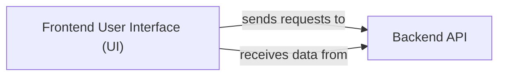

## Details

One paragraph explaining the functionality which is represented by this graph. What the main flow is and what is its purpose.

### Frontend User Interface (UI) [[Expand]](./Frontend_User_Interface_UI_.md)
The Frontend User Interface (UI) is the interactive web application that serves as the primary touchpoint for users. It enables users to input natural language requests or repository details, initiate the diagram generation process, and visualize the resulting architectural diagrams. This component is responsible for all client-side interactions, including user input handling, displaying AI-generated content, and managing user-specific settings within the SaaS platform. It provides a rich, responsive experience, leveraging modern web technologies to ensure seamless interaction and data presentation.

**Related Classes/Methods**:

- `src.app.[username].[repo].page.tsx` (1:1)

### Backend API
The Backend API is responsible for processing requests from the Frontend User Interface, interacting with external services (e.g., GitHub, AI models), and generating architectural diagrams. It handles business logic, data processing, and serves as the central hub for all server-side operations. This component ensures secure and efficient communication between the frontend and various backend services, providing the necessary data and computational power for diagram generation.

**Related Classes/Methods**:

- `backend.app.main`

### [FAQ](https://github.com/CodeBoarding/GeneratedOnBoardings/tree/main?tab=readme-ov-file#faq)