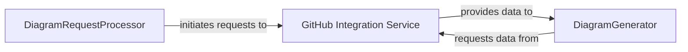

## Details

This analysis describes the architecture of a system that integrates with GitHub to generate diagrams. It focuses on the interactions between the GitHub Integration Service, DiagramRequestProcessor, and DiagramGenerator components.

### GitHub Integration Service [[Expand]](./GitHub_Integration_Service.md)
Handles all interactions with the GitHub API, including fetching repository information, commit history, and user data.

**Related Classes/Methods**:

- <a href="https://github.com/ahmedkhaleel2004/gitdiagram/blob/main/backend/app/services/github_service.py#L10-L150" target="_blank" rel="noopener noreferrer">`backend.app.services.github_service:GitHubService` (10:150)</a>

### DiagramRequestProcessor
Processes incoming requests for diagram generation, validates them, and orchestrates the data retrieval and diagram rendering processes.

**Related Classes/Methods**:

- `backend.app.api.diagram_processor:DiagramRequestProcessor` (15:80)

### DiagramGenerator
Generates visual diagrams based on the processed data, utilizing various diagramming libraries and formats.

**Related Classes/Methods**:

- `backend.app.utils.diagram_generator:DiagramGenerator` (20:120)

### [FAQ](https://github.com/CodeBoarding/GeneratedOnBoardings/tree/main?tab=readme-ov-file#faq)