```mermaid
graph LR
    Frontend_User_Interface_UI_["Frontend User Interface (UI)"]
    Backend_API_Gateway["Backend API Gateway"]
    AI_Core_Service["AI Core Service"]
    GitHub_Integration_Service["GitHub Integration Service"]
    Diagram_Generation_Engine["Diagram Generation Engine"]
    Data_Management_Layer["Data Management Layer"]
    Authentication_Authorization_Service["Authentication & Authorization Service"]
    Frontend_User_Interface_UI_ -- "initiates requests to" --> Backend_API_Gateway
    Backend_API_Gateway -- "sends responses to" --> Frontend_User_Interface_UI_
    Backend_API_Gateway -- "orchestrates calls to" --> AI_Core_Service
    AI_Core_Service -- "provides processed data to" --> Backend_API_Gateway
    Backend_API_Gateway -- "orchestrates calls to" --> GitHub_Integration_Service
    GitHub_Integration_Service -- "provides processed processed data to" --> Backend_API_Gateway
    Backend_API_Gateway -- "orchestrates calls to" --> Diagram_Generation_Engine
    Diagram_Generation_Engine -- "sends data back to" --> Backend_API_Gateway
    Backend_API_Gateway -- "interacts with" --> Data_Management_Layer
    Data_Management_Layer -- "sends data to" --> Backend_API_Gateway
    Backend_API_Gateway -- "handles authentication/authorization via" --> Authentication_Authorization_Service
    Authentication_Authorization_Service -- "interacts with" --> Data_Management_Layer
    Data_Management_Layer -- "interacts with" --> Authentication_Authorization_Service
    AI_Core_Service -- "interacts with" --> Data_Management_Layer
    GitHub_Integration_Service -- "interacts with" --> Data_Management_Layer
    Diagram_Generation_Engine -- "interacts with" --> Data_Management_Layer
    click Frontend_User_Interface_UI_ href "https://github.com/CodeBoarding/GeneratedOnBoardings/blob/main/gitdiagram/Frontend_User_Interface_UI_.md" "Details"
    click Backend_API_Gateway href "https://github.com/CodeBoarding/GeneratedOnBoardings/blob/main/gitdiagram/Backend_API_Gateway.md" "Details"
    click GitHub_Integration_Service href "https://github.com/CodeBoarding/GeneratedOnBoardings/blob/main/gitdiagram/GitHub_Integration_Service.md" "Details"
    click Diagram_Generation_Engine href "https://github.com/CodeBoarding/GeneratedOnBoardings/blob/main/gitdiagram/Diagram_Generation_Engine.md" "Details"
    click Data_Management_Layer href "https://github.com/CodeBoarding/GeneratedOnBoardings/blob/main/gitdiagram/Data_Management_Layer.md" "Details"
    click Authentication_Authorization_Service href "https://github.com/CodeBoarding/GeneratedOnBoardings/blob/main/gitdiagram/Authentication_Authorization_Service.md" "Details"
```

## Details

Abstract Components Overview

### Frontend User Interface (UI) [[Expand]](./Frontend_User_Interface_UI_.md)
The interactive web interface for users to input requests, view generated diagrams, and manage their settings. It handles user input and displays results.

**Related Classes/Methods**:

- `src/app/[username]/[repo]/page.tsx`

### Backend API Gateway [[Expand]](./Backend_API_Gateway.md)
The central server-side component built with FastAPI that acts as the entry point for all frontend requests. It orchestrates business logic, routes requests to internal services, and serves responses. It also handles CORS and rate limiting.

**Related Classes/Methods**:

- <a href="https://github.com/ahmedkhaleel2004/gitdiagram/blob/main/backend/app/main.py" target="_blank" rel="noopener noreferrer">`backend/app/main.py`</a>

### AI Core Service
Manages communication with the OpenAI o4-mini model, preparing prompts, sending requests, and processing AI responses for diagram generation.

**Related Classes/Methods**:

- <a href="https://github.com/ahmedkhaleel2004/gitdiagram/blob/main/backend/app/services/o4_mini_openai_service.py" target="_blank" rel="noopener noreferrer">`backend/app/services/o4_mini_openai_service.py`</a>

### GitHub Integration Service [[Expand]](./GitHub_Integration_Service.md)
Handles all interactions with the GitHub API, fetching repository information, commit history, and branch details to provide context for diagrams. It supports both PAT and GitHub App authentication.

**Related Classes/Methods**:

- <a href="https://github.com/ahmedkhaleel2004/gitdiagram/blob/main/backend/app/services/github_service.py" target="_blank" rel="noopener noreferrer">`backend/app/services/github_service.py`</a>

### Diagram Generation Engine [[Expand]](./Diagram_Generation_Engine.md)
The core logic component responsible for transforming processed data (from AI or GitHub) into a visual diagram representation, converting structured data into a specific diagramming language (Mermaid). It also processes click events to link diagram elements to GitHub URLs.

**Related Classes/Methods**:

- <a href="https://github.com/ahmedkhaleel2004/gitdiagram/blob/main/backend/app/routers/generate.py" target="_blank" rel="noopener noreferrer">`backend/app/routers/generate.py`</a>

### Data Management Layer [[Expand]](./Data_Management_Layer.md)
Manages all persistent data storage and retrieval operations, likely using PostgreSQL via Drizzle ORM, including user data, diagram configurations, and generated diagram outputs. (No direct Python source code found for this layer, inferred from drizzle.config.ts).

**Related Classes/Methods**: _None_

### Authentication & Authorization Service [[Expand]](./Authentication_Authorization_Service.md)
Manages user identity, authentication (login, registration), and authorization (access control), ensuring secure access to application features. This functionality appears to be integrated within the Backend API Gateway (e.g., API key handling, rate limiting) or relies on external services not explicitly detailed in the provided source code.

**Related Classes/Methods**: _None_

### [FAQ](https://github.com/CodeBoarding/GeneratedOnBoardings/tree/main?tab=readme-ov-file#faq)