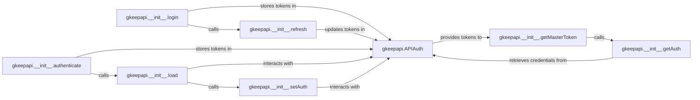

## Details

The `Authentication Manager` subsystem is dedicated to handling user authentication with Google, including obtaining, storing, and refreshing master and OAuth tokens required for API access. Its boundaries are primarily defined by the `gkeepapi.APIAuth` class and its associated methods within the `gkeepapi` package.

### gkeepapi.APIAuth
This is the core component responsible for maintaining the state of both master and OAuth authentication tokens. It acts as the central data store and manager for all authentication credentials.

**Related Classes/Methods**:

- <a href="https://github.com/kiwiz/gkeepapi/blob/main/src/gkeepapi/__init__.py" target="_blank" rel="noopener noreferrer">`gkeepapi.APIAuth`</a>

### gkeepapi.__init__.login
Orchestrates the initial user login process, typically involving external authentication flows to obtain the necessary tokens.

**Related Classes/Methods**:

- <a href="https://github.com/kiwiz/gkeepapi/blob/main/src/gkeepapi/__init__.py#L681-L709" target="_blank" rel="noopener noreferrer">`gkeepapi.__init__.login`:681-709</a>

### gkeepapi.__init__.authenticate
Provides an alternative or secondary mechanism for authenticating a session, potentially using pre-existing credentials or a different authentication flow.

**Related Classes/Methods**:

- <a href="https://github.com/kiwiz/gkeepapi/blob/main/src/gkeepapi/__init__.py#L722-L747" target="_blank" rel="noopener noreferrer">`gkeepapi.__init__.authenticate`:722-747</a>

### gkeepapi.__init__.refresh
Renews expired master and OAuth tokens to maintain continuous access to the Google Keep API without requiring a full re-login.

**Related Classes/Methods**:

- <a href="https://github.com/kiwiz/gkeepapi/blob/main/src/gkeepapi/__init__.py#L140-L164" target="_blank" rel="noopener noreferrer">`gkeepapi.__init__.refresh`:140-164</a>

### gkeepapi.__init__.load
Loads and restores previously saved authentication data, enabling session persistence across application restarts.

**Related Classes/Methods**:

- <a href="https://github.com/kiwiz/gkeepapi/blob/main/src/gkeepapi/__init__.py#L757-L774" target="_blank" rel="noopener noreferrer">`gkeepapi.__init__.load`:757-774</a>

### gkeepapi.__init__.setAuth
Applies the retrieved or newly acquired authentication credentials to the system's internal state, preparing for API requests.

**Related Classes/Methods**:

- <a href="https://github.com/kiwiz/gkeepapi/blob/main/src/gkeepapi/__init__.py#L199-L205" target="_blank" rel="noopener noreferrer">`gkeepapi.__init__.setAuth`:199-205</a>

### gkeepapi.__init__.getAuth
Retrieves the currently active authentication credentials from `gkeepapi.APIAuth`.

**Related Classes/Methods**:

- <a href="https://github.com/kiwiz/gkeepapi/blob/main/src/gkeepapi/__init__.py#L191-L197" target="_blank" rel="noopener noreferrer">`gkeepapi.__init__.getAuth`:191-197</a>

### gkeepapi.__init__.getMasterToken
Specifically retrieves the master token from the authentication manager.

**Related Classes/Methods**:

- <a href="https://github.com/kiwiz/gkeepapi/blob/main/src/gkeepapi/__init__.py#L749-L755" target="_blank" rel="noopener noreferrer">`gkeepapi.__init__.getMasterToken`:749-755</a>

### [FAQ](https://github.com/CodeBoarding/GeneratedOnBoardings/tree/main?tab=readme-ov-file#faq)