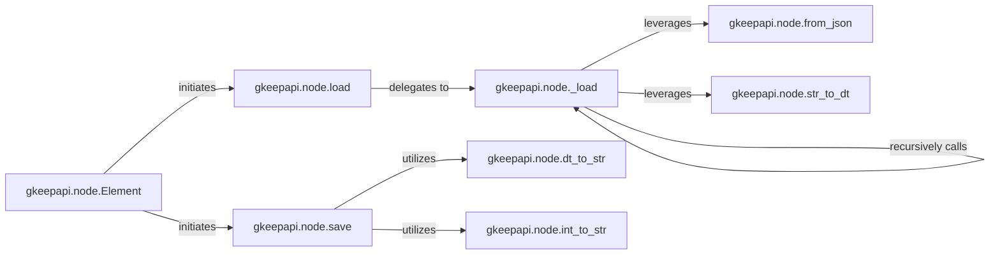

## Details

The `Data Mapper/Serializer` subsystem is primarily encapsulated within the `gkeepapi.node` module. Its core responsibility is the bidirectional conversion between raw JSON data from the Google Keep API and the structured Python objects used internally by the client library.

### gkeepapi.node.Element
Serves as the primary interface for data mapping. Its `load` method initiates the deserialization process, and its `save` method initiates the serialization process.

**Related Classes/Methods**:

- <a href="https://github.com/kiwiz/gkeepapi/blob/main/src/gkeepapi/node.py#L179-L275" target="_blank" rel="noopener noreferrer">`gkeepapi.node.Element`:179-275</a>
- <a href="https://github.com/kiwiz/gkeepapi/blob/main/src/gkeepapi/node.py" target="_blank" rel="noopener noreferrer">`gkeepapi.node.Element:load`</a>
- <a href="https://github.com/kiwiz/gkeepapi/blob/main/src/gkeepapi/node.py" target="_blank" rel="noopener noreferrer">`gkeepapi.node.Element:save`</a>

### gkeepapi.node.load
The high-level orchestrator for deserialization, converting incoming JSON into Python `Node` objects. Acts as the public entry point for deserialization. It delegates the complex parsing tasks to `gkeepapi.node._load`.

**Related Classes/Methods**:

- <a href="https://github.com/kiwiz/gkeepapi/blob/main/src/gkeepapi/node.py#L925-L937" target="_blank" rel="noopener noreferrer">`gkeepapi.node.load`:925-937</a>

### gkeepapi.node.save
The high-level orchestrator for serialization, converting Python `Node` objects into JSON-compatible formats. Acts as the public entry point for serialization. It coordinates the conversion of Python object attributes into JSON-compatible formats, utilizing helper functions like `gkeepapi.node.dt_to_str` and `gkeepapi.node.int_to_str`.

**Related Classes/Methods**:

- <a href="https://github.com/kiwiz/gkeepapi/blob/main/src/gkeepapi/node.py#L2207-L2212" target="_blank" rel="noopener noreferrer">`gkeepapi.node.save`:2207-2212</a>

### gkeepapi.node._load
Implements the detailed, recursive deserialization logic, parsing individual fields and nested structures. This is the core deserialization engine. It recursively processes JSON data, leveraging `gkeepapi.node.from_json` to create appropriate Python objects and `gkeepapi.node.str_to_dt` for specific type conversions (e.g., datetime). Its recursive nature allows it to handle complex, nested data structures.

**Related Classes/Methods**:

- <a href="https://github.com/kiwiz/gkeepapi/blob/main/src/gkeepapi/node.py#L2250-L2252" target="_blank" rel="noopener noreferrer">`gkeepapi.node._load`:2250-2252</a>

### gkeepapi.node.from_json
A utility method acting as a factory to instantiate specific Python objects (e.g., `BlobType`, `NodeType`) from their JSON representations. Responsible for dynamically creating instances of specific Python data model classes (e.g., `BlobType`, `NodeType`) based on the JSON structure.

**Related Classes/Methods**:

- <a href="https://github.com/kiwiz/gkeepapi/blob/main/src/gkeepapi/node.py#L2223-L2244" target="_blank" rel="noopener noreferrer">`gkeepapi.node.from_json`:2223-2244</a>

### gkeepapi.node.dt_to_str
A helper function for converting Python `datetime` objects to string format for JSON serialization. These are specialized utility functions that perform atomic type conversions between Python's native types and the string representations required by the Google Keep API's JSON format.

**Related Classes/Methods**:

- <a href="https://github.com/kiwiz/gkeepapi/blob/main/src/gkeepapi/node.py#L743-L753" target="_blank" rel="noopener noreferrer">`gkeepapi.node.dt_to_str`:743-753</a>

### gkeepapi.node.int_to_str
A helper function for converting integer values to string format for JSON serialization. These are specialized utility functions that perform atomic type conversions between Python's native types and the string representations required by the Google Keep API's JSON format.

**Related Classes/Methods**:

- <a href="https://github.com/kiwiz/gkeepapi/blob/main/src/gkeepapi/node.py#L755-L762" target="_blank" rel="noopener noreferrer">`gkeepapi.node.int_to_str`:755-762</a>

### gkeepapi.node.str_to_dt
A helper function for converting string representations (from JSON) into Python `datetime` objects for deserialization. These are specialized utility functions that perform atomic type conversions between Python's native types and the string representations required by the Google Keep API's JSON format.

**Related Classes/Methods**:

- <a href="https://github.com/kiwiz/gkeepapi/blob/main/src/gkeepapi/node.py#L714-L729" target="_blank" rel="noopener noreferrer">`gkeepapi.node.str_to_dt`:714-729</a>

### [FAQ](https://github.com/CodeBoarding/GeneratedOnBoardings/tree/main?tab=readme-ov-file#faq)