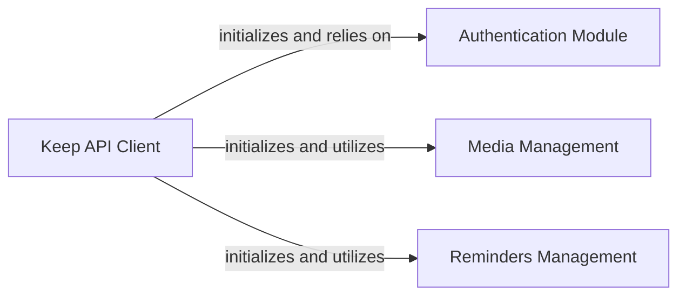

## Details

The `Keep API Client` subsystem is primarily encapsulated within the `gkeepapi` Python package. It serves as the core interface for interacting with the Google Keep API, adhering to API Client Library architectural patterns.

### Keep API Client [[Expand]](./Keep_API_Client.md)
The central facade and orchestrator for all Google Keep API interactions. It manages the overall API session, coordinates authentication, dispatches high-level requests, and handles synchronization and CRUD operations on Keep entities (notes, lists). It acts as the primary interface for external consumers.

**Related Classes/Methods**:

- <a href="https://github.com/kiwiz/gkeepapi/blob/main/src/gkeepapi/__init__.py" target="_blank" rel="noopener noreferrer">`gkeepapi.KeepAPI`</a>

### Authentication Module
Dedicated to managing authentication and token handling for the Google Keep API. It handles the login process, token refreshing, and ensures secure communication with the API.

**Related Classes/Methods**:

- <a href="https://github.com/kiwiz/gkeepapi/blob/main/src/gkeepapi/__init__.py" target="_blank" rel="noopener noreferrer">`gkeepapi.APIAuth`</a>

### Media Management
Handles media-related operations within the Google Keep API, such as uploading or retrieving images and other attachments associated with notes.

**Related Classes/Methods**:

- <a href="https://github.com/kiwiz/gkeepapi/blob/main/src/gkeepapi/__init__.py" target="_blank" rel="noopener noreferrer">`gkeepapi.MediaAPI`</a>

### Reminders Management
Manages reminder functionalities within the Google Keep API, allowing for the creation, modification, and deletion of reminders associated with notes.

**Related Classes/Methods**:

- <a href="https://github.com/kiwiz/gkeepapi/blob/main/src/gkeepapi/__init__.py" target="_blank" rel="noopener noreferrer">`gkeepapi.RemindersAPI`</a>

### [FAQ](https://github.com/CodeBoarding/GeneratedOnBoardings/tree/main?tab=readme-ov-file#faq)