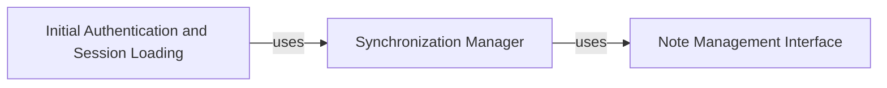

## Details

This project facilitates interaction with the Google Keep API to manage notes and labels. It comprises three main components: 'Initial Authentication and Session Loading' for secure access and data retrieval, 'Synchronization Manager' for keeping local and cloud data consistent, and 'Note Management Interface' for user interaction with notes. The system ensures data integrity and a seamless user experience by handling authentication, data synchronization, and note operations efficiently.

### Initial Authentication and Session Loading
Handles the initial authentication process with Google Keep and loads existing notes and labels for the session.

**Related Classes/Methods**: _None_

### Synchronization Manager
Manages the synchronization of changes between the local application and Google Keep.

**Related Classes/Methods**:

- <a href="https://github.com/kiwiz/gkeepapi/blob/main/" target="_blank" rel="noopener noreferrer">`gkeepapi.API.sync`</a>
- <a href="https://github.com/kiwiz/gkeepapi/blob/main/" target="_blank" rel="noopener noreferrer">`gkeepapi.API.find`</a>

### Note Management Interface
Provides an interface for users to interact with their notes, including creating, editing, and deleting them.

**Related Classes/Methods**:

- <a href="https://github.com/kiwiz/gkeepapi/blob/main/" target="_blank" rel="noopener noreferrer">`gkeepapi.API.createNote`</a>
- <a href="https://github.com/kiwiz/gkeepapi/blob/main/" target="_blank" rel="noopener noreferrer">`gkeepapi.API.get`</a>
- <a href="https://github.com/kiwiz/gkeepapi/blob/main/" target="_blank" rel="noopener noreferrer">`gkeepapi.node.Note.save`</a>
- <a href="https://github.com/kiwiz/gkeepapi/blob/main/" target="_blank" rel="noopener noreferrer">`gkeepapi.node.Note.delete`</a>

### [FAQ](https://github.com/CodeBoarding/GeneratedOnBoardings/tree/main?tab=readme-ov-file#faq)