```mermaid
graph LR
    Keep_API_Client["Keep API Client"]
    Authentication_Manager["Authentication Manager"]
    Request_Dispatcher["Request Dispatcher"]
    Data_Mapper_Serializer["Data Mapper/Serializer"]
    Keep_Data_Models["Keep Data Models"]
    Keep_API_Client -- "delegates authentication to" --> Authentication_Manager
    Authentication_Manager -- "provides tokens to" --> Request_Dispatcher
    Keep_API_Client -- "sends requests via" --> Request_Dispatcher
    Request_Dispatcher -- "forwards raw responses to" --> Data_Mapper_Serializer
    Data_Mapper_Serializer -- "transforms into" --> Keep_Data_Models
    Keep_API_Client -- "manages/operates on" --> Keep_Data_Models
    Keep_Data_Models -- "provides data for serialization to" --> Data_Mapper_Serializer
    click Keep_API_Client href "https://github.com/CodeBoarding/GeneratedOnBoardings/blob/main/gkeepapi/Keep_API_Client.md" "Details"
    click Authentication_Manager href "https://github.com/CodeBoarding/GeneratedOnBoardings/blob/main/gkeepapi/Authentication_Manager.md" "Details"
    click Request_Dispatcher href "https://github.com/CodeBoarding/GeneratedOnBoardings/blob/main/gkeepapi/Request_Dispatcher.md" "Details"
    click Data_Mapper_Serializer href "https://github.com/CodeBoarding/GeneratedOnBoardings/blob/main/gkeepapi/Data_Mapper_Serializer.md" "Details"
```

## Details

The `gkeepapi` library functions as a robust API client, orchestrating interactions with the Google Keep service through a well-defined architectural flow. The core process begins with the `Keep API Client` acting as the primary facade, handling user authentication via the `Authentication Manager`. Once authenticated, the `Keep API Client` dispatches high-level requests, which are then translated into low-level HTTP operations by the `Request Dispatcher`. This dispatcher communicates directly with the Google Keep API, receiving raw JSON responses. These raw responses are subsequently processed by the `Data Mapper/Serializer`, which transforms them into structured Python objects represented by the `Keep Data Models`. Conversely, when local changes to `Keep Data Models` need to be synchronized with the API, the `Data Mapper/Serializer` converts these Python objects back into JSON for the `Request Dispatcher` to send. This clear separation of concerns ensures efficient data flow, robust error handling, and maintainable code, making it ideal for diagrammatic representation. The `gkeepapi` architecture is centered around the `Keep API Client`, which serves as the primary interface for interacting with Google Keep. This client delegates authentication responsibilities to the `Authentication Manager` and relies on the `Request Dispatcher` for all low-level HTTP communication with the Google Keep API. Data exchanged with the API, typically in JSON format, is seamlessly converted to and from structured Python objects (`Keep Data Models`) by the `Data Mapper/Serializer`. This design ensures a clear, unidirectional flow of data and control, from user-initiated actions through the `Keep API Client`, to network requests handled by the `Request Dispatcher`, and finally to data representation managed by the `Data Mapper/Serializer` and `Keep Data Models`, making it highly suitable for visual flow graph representation.

### Keep API Client [[Expand]](./Keep_API_Client.md)
The main entry point and orchestrator for all interactions with the Google Keep API. It acts as a facade, managing the overall API session, coordinating authentication, dispatching high-level requests, and handling synchronization and CRUD operations on Keep entities.

**Related Classes/Methods**:

- <a href="https://github.com/kiwiz/gkeepapi/blob/main/src/gkeepapi/__init__.py" target="_blank" rel="noopener noreferrer">`gkeepapi.KeepAPI`</a>
- <a href="https://github.com/kiwiz/gkeepapi/blob/main/src/gkeepapi/__init__.py" target="_blank" rel="noopener noreferrer">`gkeepapi.KeepAPI.login`</a>
- <a href="https://github.com/kiwiz/gkeepapi/blob/main/src/gkeepapi/__init__.py" target="_blank" rel="noopener noreferrer">`gkeepapi.KeepAPI.sync`</a>
- <a href="https://github.com/kiwiz/gkeepapi/blob/main/src/gkeepapi/__init__.py" target="_blank" rel="noopener noreferrer">`gkeepapi.KeepAPI.createNote`</a>

### Authentication Manager [[Expand]](./Authentication_Manager.md)
Dedicated to handling user authentication with Google, including obtaining, storing, and refreshing master and OAuth tokens required for API access.

**Related Classes/Methods**:

- <a href="https://github.com/kiwiz/gkeepapi/blob/main/src/gkeepapi/__init__.py" target="_blank" rel="noopener noreferrer">`gkeepapi.APIAuth`</a>
- <a href="https://github.com/kiwiz/gkeepapi/blob/main/src/gkeepapi/__init__.py" target="_blank" rel="noopener noreferrer">`gkeepapi.APIAuth.login`</a>

### Request Dispatcher [[Expand]](./Request_Dispatcher.md)
Responsible for the low-level details of constructing, sending, and receiving raw HTTP requests and responses from the Google Keep API. It includes retry mechanisms for handling expired authentication tokens.

**Related Classes/Methods**:

- <a href="https://github.com/kiwiz/gkeepapi/blob/main/src/gkeepapi/__init__.py" target="_blank" rel="noopener noreferrer">`gkeepapi.API`</a>
- <a href="https://github.com/kiwiz/gkeepapi/blob/main/src/gkeepapi/__init__.py" target="_blank" rel="noopener noreferrer">`gkeepapi.API.send`</a>

### Data Mapper/Serializer [[Expand]](./Data_Mapper_Serializer.md)
Handles the bidirectional conversion between the raw JSON data exchanged with the Google Keep API and the structured Python objects defined in the Keep Data Models. It performs object serialization (Python objects to JSON) and deserialization (JSON to Python objects).

**Related Classes/Methods**:

- <a href="https://github.com/kiwiz/gkeepapi/blob/main/src/gkeepapi/node.py" target="_blank" rel="noopener noreferrer">`gkeepapi.node.Element.load`</a>
- <a href="https://github.com/kiwiz/gkeepapi/blob/main/src/gkeepapi/node.py" target="_blank" rel="noopener noreferrer">`gkeepapi.node.Element.save`</a>

### Keep Data Models
A collection of classes and enumerations representing the structured data of Google Keep entities (e.g., Notes, Lists, ListItems, Labels, Images). These models encapsulate data and provide basic entity-specific logic, including tracking changes.

**Related Classes/Methods**:

- <a href="https://github.com/kiwiz/gkeepapi/blob/main/src/gkeepapi/node.py#L179-L275" target="_blank" rel="noopener noreferrer">`gkeepapi.node.Element`:179-275</a>
- <a href="https://github.com/kiwiz/gkeepapi/blob/main/src/gkeepapi/node.py#L25-L38" target="_blank" rel="noopener noreferrer">`gkeepapi.node.NodeType`:25-38</a>
- <a href="https://github.com/kiwiz/gkeepapi/blob/main/src/gkeepapi/node.py#L54-L91" target="_blank" rel="noopener noreferrer">`gkeepapi.node.ColorValue`:54-91</a>

### [FAQ](https://github.com/CodeBoarding/GeneratedOnBoardings/tree/main?tab=readme-ov-file#faq)