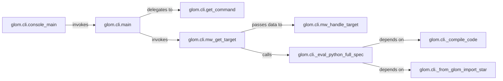

## Details

The CLI Interface subsystem is primarily defined by the `glom.cli` package, with its core functionality centered around the `glom.cli.main` function and related components within the `/mnt/e/StartUp/glom/glom/cli.py` file. It acts as the external entry point for users to interact with `glom`, handling argument parsing and initiating the data transformation process. The `CLI Interface` subsystem operates as a pipeline, starting with `console_main` as the entry point. `main` orchestrates the flow, first parsing user input via `get_command`. It then proceeds to retrieve and evaluate the target data/specification using `mw_get_target`. This retrieval often involves dynamic execution of Python code, facilitated by `_eval_python_full_spec`, which in turn relies on `_compile_code` for compilation and `_from_glom_import_star` for environment setup. Finally, `mw_handle_target` processes the evaluated target, preparing it for the core `glom` transformation engine (which is external to this specific CLI subsystem). This structure effectively separates argument handling and dynamic evaluation concerns within the CLI.

### glom.cli.console_main
The absolute top-level entry point for the `glom` command-line application. It initiates the entire CLI execution flow.

**Related Classes/Methods**:

- <a href="https://github.com/mahmoud/glom/blob/master/glom/cli.py#L106-L115" target="_blank" rel="noopener noreferrer">`glom.cli.console_main`:106-115</a>

### glom.cli.main
The central orchestrator of the CLI. It coordinates the overall process, including argument parsing, command dispatch, and high-level error handling.

**Related Classes/Methods**:

- <a href="https://github.com/mahmoud/glom/blob/master/glom/cli.py#L101-L103" target="_blank" rel="noopener noreferrer">`glom.cli.main`:101-103</a>

### glom.cli.get_command
Responsible for parsing command-line arguments provided by the user, interpreting them to determine the specific `glom` operation or transformation requested.

**Related Classes/Methods**:

- <a href="https://github.com/mahmoud/glom/blob/master/glom/cli.py#L80-L98" target="_blank" rel="noopener noreferrer">`glom.cli.get_command`:80-98</a>

### glom.cli.mw_get_target
A middleware component focused on retrieving and evaluating the target data or specification. This often involves dynamic evaluation of Python expressions provided via the command line.

**Related Classes/Methods**:

- <a href="https://github.com/mahmoud/glom/blob/master/glom/cli.py#L167-L212" target="_blank" rel="noopener noreferrer">`glom.cli.mw_get_target`:167-212</a>

### glom.cli.mw_handle_target
A middleware component that processes the target data or specification after it has been obtained and evaluated. It prepares the data/spec for consumption by the core `glom` transformation engine.

**Related Classes/Methods**:

- <a href="https://github.com/mahmoud/glom/blob/master/glom/cli.py#L118-L164" target="_blank" rel="noopener noreferrer">`glom.cli.mw_handle_target`:118-164</a>

### glom.cli._eval_python_full_spec
Handles the dynamic evaluation of Python code or specifications provided as strings. This is crucial for `glom`'s flexibility, allowing users to define complex transformations directly in the CLI.

**Related Classes/Methods**:

- <a href="https://github.com/mahmoud/glom/blob/master/glom/cli.py#L225-L230" target="_blank" rel="noopener noreferrer">`glom.cli._eval_python_full_spec`:225-230</a>

### glom.cli._compile_code
A utility function that compiles raw Python code strings into executable code objects, a prerequisite for dynamic evaluation.

**Related Classes/Methods**:

- <a href="https://github.com/mahmoud/glom/blob/master/glom/cli.py#L233-L241" target="_blank" rel="noopener noreferrer">`glom.cli._compile_code`:233-241</a>

### glom.cli._from_glom_import_star
A helper function that sets up the execution environment for dynamically evaluated Python code. It ensures that `glom`'s core functionalities (e.g., `glom` function, `T`) are available within the scope of the evaluated code.

**Related Classes/Methods**:

- <a href="https://github.com/mahmoud/glom/blob/master/glom/cli.py#L215-L222" target="_blank" rel="noopener noreferrer">`glom.cli._from_glom_import_star`:215-222</a>

### [FAQ](https://github.com/CodeBoarding/GeneratedOnBoardings/tree/main?tab=readme-ov-file#faq)