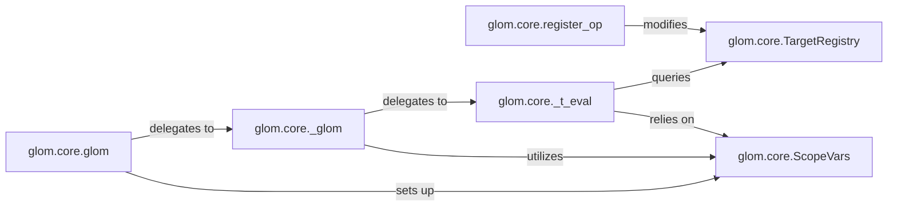

## Details

The `Core Transformation Engine` subsystem in `glom` is primarily defined by the `glom.core` module, specifically encompassing the core transformation logic. Its boundaries are marked by the public `glom.core.glom` function, the internal recursive `glom.core._glom` engine, the `glom.core._t_eval` evaluation mechanism, and the supporting infrastructure for context management (`glom.core.ScopeVars`) and operation dispatch (`glom.core.TargetRegistry`, `glom.core.register_op`).

### glom.core.glom
The primary public API entry point for initiating data transformations. It acts as the orchestrator, setting up the initial execution context, including `ScopeVars`, and delegating the core transformation process to `_glom`.

**Related Classes/Methods**:

- <a href="https://github.com/mahmoud/glom/blob/master/glom/core.py#L2504-L2505" target="_blank" rel="noopener noreferrer">`glom.core.glom`:2504-2505</a>

### glom.core._glom
The internal, recursive transformation engine. It interprets the overall transformation specification (`spec`) and iteratively applies it to the data, delegating individual transformation steps to `_t_eval`. This component is central to the pipeline's execution.

**Related Classes/Methods**:

- <a href="https://github.com/mahmoud/glom/blob/master/glom/core.py#L2330-L2361" target="_blank" rel="noopener noreferrer">`glom.core._glom`:2330-2361</a>

### glom.core._t_eval
The core evaluation engine responsible for processing individual transformation nodes (instances of `TType`). It dispatches operations to the correct handlers based on the `TargetRegistry`, effectively executing the specific transformation logic.

**Related Classes/Methods**:

- <a href="https://github.com/mahmoud/glom/blob/master/glom/core.py#L1538-L1656" target="_blank" rel="noopener noreferrer">`glom.core._t_eval`:1538-1656</a>

### glom.core.ScopeVars
Manages the dynamic scope and contextual variables during a transformation's execution. It provides crucial runtime context, such as the current data target and root data, enabling flexible and context-aware transformations within the DSL.

**Related Classes/Methods**:

- <a href="https://github.com/mahmoud/glom/blob/master/glom/core.py#L1797-L1815" target="_blank" rel="noopener noreferrer">`glom.core.ScopeVars`:1797-1815</a>

### glom.core.TargetRegistry
A central registry that maps data types and operations to their corresponding transformation handlers. It is fundamental for enabling polymorphic behavior and allowing `_t_eval` to correctly dispatch operations based on the current data and specification.

**Related Classes/Methods**:

- <a href="https://github.com/mahmoud/glom/blob/master/glom/core.py#L1989-L2180" target="_blank" rel="noopener noreferrer">`glom.core.TargetRegistry`:1989-2180</a>

### glom.core.register_op
A utility function that provides extensibility to the `glom` engine. It allows users to register custom transformation operations or override built-in ones by modifying the `TargetRegistry`, thereby extending the library's capabilities.

**Related Classes/Methods**:

- <a href="https://github.com/mahmoud/glom/blob/master/glom/core.py#L2431-L2437" target="_blank" rel="noopener noreferrer">`glom.core.register_op`:2431-2437</a>

### [FAQ](https://github.com/CodeBoarding/GeneratedOnBoardings/tree/main?tab=readme-ov-file#faq)