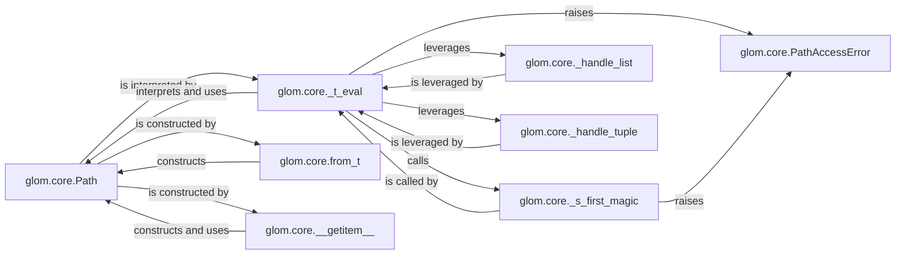

## Details

The Data Access & Navigation subsystem in glom, responsible for interpreting navigation paths and accessing specific data elements within complex input objects.

### glom.core.Path
The fundamental immutable data structure representing a sequence of keys or indices. It serves as the declarative Domain-Specific Language (DSL) for navigating data structures.

**Related Classes/Methods**:

- <a href="https://github.com/mahmoud/glom/blob/master/glom/core.py" target="_blank" rel="noopener noreferrer">`glom.core.Path`</a>

### glom.core._t_eval
The central evaluation engine for data access. It interprets `Path` objects and executes the traversal logic, embodying the "Data Access Layer/Selector" pattern.

**Related Classes/Methods**:

- <a href="https://github.com/mahmoud/glom/blob/master/glom/core.py#L1538-L1656" target="_blank" rel="noopener noreferrer">`glom.core._t_eval`:1538-1656</a>

### glom.core._s_first_magic
A specialized handler for the initial segment of a `Path`, managing "magic" operations or special access logic at the start of a traversal.

**Related Classes/Methods**:

- <a href="https://github.com/mahmoud/glom/blob/master/glom/core.py#L1523-L1535" target="_blank" rel="noopener noreferrer">`glom.core._s_first_magic`:1523-1535</a>

### glom.core._handle_list
Provides specific logic for navigating and accessing elements within list-like data structures during path traversal.

**Related Classes/Methods**:

- <a href="https://github.com/mahmoud/glom/blob/master/glom/core.py#L1933-L1951" target="_blank" rel="noopener noreferrer">`glom.core._handle_list`:1933-1951</a>

### glom.core._handle_tuple
Provides specific logic for navigating and accessing elements within tuple-like data structures during path traversal.

**Related Classes/Methods**:

- <a href="https://github.com/mahmoud/glom/blob/master/glom/core.py#L1954-L1966" target="_blank" rel="noopener noreferrer">`glom.core._handle_tuple`:1954-1966</a>

### glom.core.PathAccessError
The dedicated exception class for signaling errors encountered during path-based data access, crucial for robust error handling within the data processing pipeline.

**Related Classes/Methods**:

- <a href="https://github.com/mahmoud/glom/blob/master/glom/core.py#L310-L354" target="_blank" rel="noopener noreferrer">`glom.core.PathAccessError`:310-354</a>

### glom.core.from_t
A utility function for programmatically constructing `Path` objects, supporting the flexible creation of navigation instructions.

**Related Classes/Methods**:

- <a href="https://github.com/mahmoud/glom/blob/master/glom/core.py#L719-L726" target="_blank" rel="noopener noreferrer">`glom.core.from_t`:719-726</a>

### glom.core.__getitem__
Enables a convenient, Pythonic syntax (e.g., `T['key']`) for defining paths, which internally constructs `Path` objects, enhancing the DSL's usability.

**Related Classes/Methods**:

- <a href="https://github.com/mahmoud/glom/blob/master/glom/core.py#L1436-L1437" target="_blank" rel="noopener noreferrer">`glom.core.__getitem__`:1436-1437</a>

### [FAQ](https://github.com/CodeBoarding/GeneratedOnBoardings/tree/main?tab=readme-ov-file#faq)