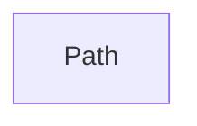

## Details

Updated source file reference for Path component.

### Path
Represents navigable paths within data structures.

**Related Classes/Methods**:

- <a href="https://github.com/mahmoud/glom/blob/master/glom/core.py" target="_blank" rel="noopener noreferrer">`glom.Path`</a>

### [FAQ](https://github.com/CodeBoarding/GeneratedOnBoardings/tree/main?tab=readme-ov-file#faq)