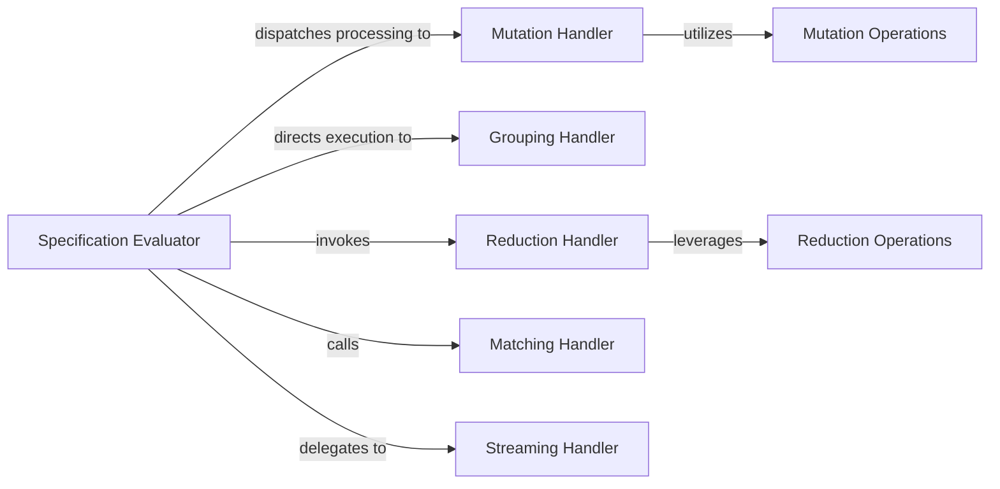

## Details

The `glom` library's core transformation engine is orchestrated by the `Specification Evaluator`, which serves as the central control point for data manipulation. It interprets the user-defined `glom` specification and intelligently dispatches the transformation tasks to specialized handlers. These handlers, including `Mutation Handler`, `Grouping Handler`, `Reduction Handler`, `Matching Handler`, and `Streaming Handler`, each manage a specific type of data operation. The `Mutation Handler` and `Reduction Handler` further leverage dedicated `Mutation Operations` and `Reduction Operations` components, respectively, which encapsulate the atomic actions required for these transformations. This modular design ensures efficient and organized processing of complex data transformations, with clear responsibilities assigned to each component.

### Specification Evaluator
This component acts as the orchestrator within the Core Transformation Engine. It interprets the glom specification and dispatches the data transformation tasks to the appropriate specialized handlers (Mutation, Grouping, Reduction, Matching, Streaming).

**Related Classes/Methods**: _None_

### Mutation Handler
Responsible for executing data mutation operations, such as assigning new values to existing elements or deleting elements from data structures.

**Related Classes/Methods**:

- <a href="https://github.com/mahmoud/glom/blob/master/glom/mutation.py#L312-L328" target="_blank" rel="noopener noreferrer">`glom.mutation.glomit`:312-328</a>

### Grouping Handler
Manages operations that group data based on specified criteria, enabling aggregation and categorization of data.

**Related Classes/Methods**:

- <a href="https://github.com/mahmoud/glom/blob/master/glom/grouping.py#L303-L313" target="_blank" rel="noopener noreferrer">`glom.grouping.glomit`:303-313</a>

### Reduction Handler
Performs data reduction operations, including aggregation, folding, flattening, and merging, to condense or combine data.

**Related Classes/Methods**:

- <a href="https://github.com/mahmoud/glom/blob/master/glom/reduction.py#L68-L83" target="_blank" rel="noopener noreferrer">`glom.reduction.glomit`:68-83</a>

### Matching Handler
Implements logic for matching data against specifications and performing validation, often used for conditional transformations or data filtering.

**Related Classes/Methods**:

- <a href="https://github.com/mahmoud/glom/blob/master/glom/matching.py#L958-L1008" target="_blank" rel="noopener noreferrer">`glom.matching.glomit`:958-1008</a>

### Streaming Handler
Provides capabilities for processing data streams efficiently, including mapping, filtering, chunking, and windowing, optimized for large datasets.

**Related Classes/Methods**:

- <a href="https://github.com/mahmoud/glom/blob/master/glom/streaming.py#L378-L379" target="_blank" rel="noopener noreferrer">`glom.streaming.glomit`:378-379</a>

### Mutation Operations
Specific classes that define the atomic mutation actions, such as Assign and Delete, which are utilized by the Mutation Handler.

**Related Classes/Methods**:

- <a href="https://github.com/mahmoud/glom/blob/master/glom/mutation.py#L198-L213" target="_blank" rel="noopener noreferrer">`glom.mutation.Assign`:198-213</a>
- <a href="https://github.com/mahmoud/glom/blob/master/glom/mutation.py#L335-L356" target="_blank" rel="noopener noreferrer">`glom.mutation.Delete`:335-356</a>

### Reduction Operations
Specific classes that define the atomic reduction actions, such as Flatten and Merge, which are utilized by the Reduction Handler.

**Related Classes/Methods**:

- <a href="https://github.com/mahmoud/glom/blob/master/glom/reduction.py#L189-L263" target="_blank" rel="noopener noreferrer">`glom.reduction.Flatten`:189-263</a>
- <a href="https://github.com/mahmoud/glom/blob/master/glom/reduction.py#L322-L348" target="_blank" rel="noopener noreferrer">`glom.reduction.Merge`:322-348</a>

### [FAQ](https://github.com/CodeBoarding/GeneratedOnBoardings/tree/main?tab=readme-ov-file#faq)