```mermaid
graph LR
    CLI_Interface["CLI Interface"]
    Core_Transformation_Engine["Core Transformation Engine"]
    Specification_Management["Specification Management"]
    Data_Access_Navigation["Data Access & Navigation"]
    Transformation_Operations["Transformation Operations"]
    CLI_Interface -- "initiates transformation with" --> Core_Transformation_Engine
    Core_Transformation_Engine -- "requests interpretation and validation from" --> Specification_Management
    Core_Transformation_Engine -- "utilizes for data traversal" --> Data_Access_Navigation
    Core_Transformation_Engine -- "dispatches tasks to" --> Transformation_Operations
    Specification_Management -- "defines paths for" --> Data_Access_Navigation
    Transformation_Operations -- "accesses and modifies data via" --> Data_Access_Navigation
    click CLI_Interface href "https://github.com/CodeBoarding/GeneratedOnBoardings/blob/main/glom/CLI_Interface.md" "Details"
    click Core_Transformation_Engine href "https://github.com/CodeBoarding/GeneratedOnBoardings/blob/main/glom/Core_Transformation_Engine.md" "Details"
    click Specification_Management href "https://github.com/CodeBoarding/GeneratedOnBoardings/blob/main/glom/Specification_Management.md" "Details"
    click Data_Access_Navigation href "https://github.com/CodeBoarding/GeneratedOnBoardings/blob/main/glom/Data_Access_Navigation.md" "Details"
    click Transformation_Operations href "https://github.com/CodeBoarding/GeneratedOnBoardings/blob/main/glom/Transformation_Operations.md" "Details"
```

## Details

The `glom` architecture is centered around a robust data transformation pipeline, designed for efficient data manipulation via a declarative Domain-Specific Language (DSL). The `CLI Interface` serves as the user's gateway, feeding input data and transformation `Specification`s to the `Core Transformation Engine`. This engine, the heart of the system, orchestrates the entire process: it consults `Specification Management` to interpret the user's intent, utilizes `Data Access & Navigation` to precisely locate data within complex structures, and delegates specific data modifications to various `Transformation Operations` modules. This clear separation of concerns—input handling, specification interpretation, data access, and operation execution—enables `glom` to provide a flexible and powerful framework for data processing, emphasizing the flow from raw input through a series of guided transformations to a final, desired output.

### CLI Interface [[Expand]](./CLI_Interface.md)
The command-line interface, acting as the external entry point for users to interact with `glom`. It handles argument parsing and initiates the core data transformation process.

**Related Classes/Methods**:

- <a href="https://github.com/mahmoud/glom/blob/master/glom/cli.py#L101-L103" target="_blank" rel="noopener noreferrer">`glom.cli.main`:101-103</a>

### Core Transformation Engine [[Expand]](./Core_Transformation_Engine.md)
The central orchestrator of `glom`, responsible for interpreting specifications, managing the overall transformation flow, and dispatching operations to specialized modules. This component takes input data and a specification, applying the transformations to produce the output.

**Related Classes/Methods**:

- <a href="https://github.com/mahmoud/glom/blob/master/glom/core.py#L2504-L2505" target="_blank" rel="noopener noreferrer">`glom.core.glom`:2504-2505</a>
- <a href="https://github.com/mahmoud/glom/blob/master/glom/core.py#L2330-L2361" target="_blank" rel="noopener noreferrer">`glom.core._glom`:2330-2361</a>
- <a href="https://github.com/mahmoud/glom/blob/master/glom/core.py#L1538-L1656" target="_blank" rel="noopener noreferrer">`glom.core._t_eval`:1538-1656</a>
- <a href="https://github.com/mahmoud/glom/blob/master/glom/core.py#L2431-L2437" target="_blank" rel="noopener noreferrer">`glom.core.register_op`:2431-2437</a>
- <a href="https://github.com/mahmoud/glom/blob/master/glom/core.py#L1797-L1815" target="_blank" rel="noopener noreferrer">`glom.core.ScopeVars`:1797-1815</a>
- <a href="https://github.com/mahmoud/glom/blob/master/glom/core.py#L1989-L2180" target="_blank" rel="noopener noreferrer">`glom.core.TargetRegistry`:1989-2180</a>

### Specification Management [[Expand]](./Specification_Management.md)
Manages the creation, parsing, validation, and internal representation of `glom` specifications, including the crucial `Path` objects. It ensures specifications are correctly understood and prepared for the `Core Transformation Engine`.

**Related Classes/Methods**:

- <a href="https://github.com/mahmoud/glom/blob/master/glom/core.py#L640-L669" target="_blank" rel="noopener noreferrer">`glom.core.from_text`:640-669</a>
- <a href="https://github.com/mahmoud/glom/blob/master/glom/core.py#L1102-L1109" target="_blank" rel="noopener noreferrer">`glom.core._is_spec`:1102-1109</a>
- <a href="https://github.com/mahmoud/glom/blob/master/glom/core.py#L1353-L1509" target="_blank" rel="noopener noreferrer">`glom.core.TType`:1353-1509</a>
- <a href="https://github.com/mahmoud/glom/blob/master/glom/core.py#L2583-L2592" target="_blank" rel="noopener noreferrer">`glom.core.arg_val`:2583-2592</a>
- <a href="https://github.com/mahmoud/glom/blob/master/glom/core.py#L1954-L1966" target="_blank" rel="noopener noreferrer">`glom.core._handle_tuple`:1954-1966</a>
- <a href="https://github.com/mahmoud/glom/blob/master/glom/core.py#L1933-L1951" target="_blank" rel="noopener noreferrer">`glom.core._handle_list`:1933-1951</a>
- <a href="https://github.com/mahmoud/glom/blob/master/glom/core.py#L1921-L1930" target="_blank" rel="noopener noreferrer">`glom.core._handle_dict`:1921-1930</a>
- <a href="https://github.com/mahmoud/glom/blob/master/glom/core.py" target="_blank" rel="noopener noreferrer">`glom.core.Path`</a>

### Data Access & Navigation [[Expand]](./Data_Access_Navigation.md)
Provides the fundamental mechanisms for navigating complex data structures and accessing specific data elements based on defined paths within the input object. This component is heavily reliant on the `Path` object defined within `Specification Management`.

**Related Classes/Methods**:

- <a href="https://github.com/mahmoud/glom/blob/master/glom/core.py" target="_blank" rel="noopener noreferrer">`glom.core.Path`</a>

### Transformation Operations [[Expand]](./Transformation_Operations.md)
A collection of specialized modules that implement the various data manipulation operations supported by `glom`, such as mutation, grouping, reduction, matching, and streaming. The `Core Transformation Engine` dispatches tasks to these modules.

**Related Classes/Methods**:

- <a href="https://github.com/mahmoud/glom/blob/master/glom/mutation.py#L312-L328" target="_blank" rel="noopener noreferrer">`glom.mutation.glomit`:312-328</a>
- <a href="https://github.com/mahmoud/glom/blob/master/glom/grouping.py#L303-L313" target="_blank" rel="noopener noreferrer">`glom.grouping.glomit`:303-313</a>
- <a href="https://github.com/mahmoud/glom/blob/master/glom/reduction.py#L68-L83" target="_blank" rel="noopener noreferrer">`glom.reduction.glomit`:68-83</a>
- <a href="https://github.com/mahmoud/glom/blob/master/glom/matching.py#L958-L1008" target="_blank" rel="noopener noreferrer">`glom.matching.glomit`:958-1008</a>
- <a href="https://github.com/mahmoud/glom/blob/master/glom/streaming.py#L378-L379" target="_blank" rel="noopener noreferrer">`glom.streaming.glomit`:378-379</a>

### [FAQ](https://github.com/CodeBoarding/GeneratedOnBoardings/tree/main?tab=readme-ov-file#faq)