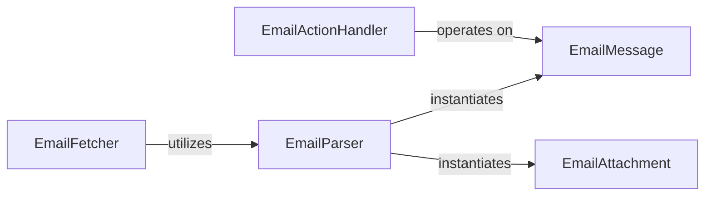

## Details

The `gmail` subsystem is designed to abstract and manage email interactions, focusing on fetching, parsing, and acting upon email data. At its core, the `EmailMessage` and `EmailAttachment` components serve as the primary data models, representing structured email content and associated files, respectively. The `EmailFetcher` is responsible for retrieving raw email data from the Gmail service, subsequently passing it to the `EmailParser`. The `EmailParser` then transforms this raw data into the structured `EmailMessage` and `EmailAttachment` objects. Finally, the `EmailActionHandler` provides the capability to perform various operations, such as moving or deleting, directly on these `EmailMessage` objects, completing the lifecycle of email management within the subsystem.

### EmailMessage
The central data model representing a single email message or a conversational thread. It encapsulates parsed email content, headers, flags, labels, and references to attachments, providing a high-level Pythonic abstraction over raw email data.

**Related Classes/Methods**:

- <a href="https://github.com/charlierguo/gmail/blob/master/gmail/message.py" target="_blank" rel="noopener noreferrer">`gmail.message.Message`</a>

### EmailAttachment
Represents an individual file attached to an EmailMessage. It encapsulates the attachment's metadata and provides mechanisms for accessing its content.

**Related Classes/Methods**:

- <a href="https://github.com/charlierguo/gmail/blob/master/gmail/message.py" target="_blank" rel="noopener noreferrer">`gmail.message.Attachment`</a>

### EmailParser
Responsible for transforming raw email data (e.g., from Gmail API responses) into structured EmailMessage and EmailAttachment objects. It orchestrates the parsing of various email components such as headers, labels, flags, and subject lines.

**Related Classes/Methods**:

- <a href="https://github.com/charlierguo/gmail/blob/master/gmail/message.py#L136-L174" target="_blank" rel="noopener noreferrer">`gmail.message.parse`:136-174</a>
- <a href="https://github.com/charlierguo/gmail/blob/master/gmail/message.py#L124-L129" target="_blank" rel="noopener noreferrer">`gmail.message.parse_labels`:124-129</a>
- <a href="https://github.com/charlierguo/gmail/blob/master/gmail/message.py#L120-L121" target="_blank" rel="noopener noreferrer">`gmail.message.parse_flags`:120-121</a>
- <a href="https://github.com/charlierguo/gmail/blob/master/gmail/message.py#L131-L134" target="_blank" rel="noopener noreferrer">`gmail.message.parse_subject`:131-134</a>
- <a href="https://github.com/charlierguo/gmail/blob/master/gmail/message.py#L114-L118" target="_blank" rel="noopener noreferrer">`gmail.message.parse_headers`:114-118</a>

### EmailFetcher
Manages the retrieval of email messages and entire conversational threads from the underlying Gmail service. It handles the low-level fetching mechanisms and utilizes the EmailParser to construct usable EmailMessage objects from the raw data.

**Related Classes/Methods**:

- <a href="https://github.com/charlierguo/gmail/blob/master/gmail/message.py#L177-L183" target="_blank" rel="noopener noreferrer">`gmail.message.fetch`:177-183</a>
- <a href="https://github.com/charlierguo/gmail/blob/master/gmail/message.py#L186-L213" target="_blank" rel="noopener noreferrer">`gmail.message.fetch_thread`:186-213</a>

### EmailActionHandler
Provides methods for performing state-changing actions on EmailMessage objects, such as moving them between mailboxes (e.g., to Trash, Inbox, custom labels), archiving, or deleting. It abstracts the underlying Gmail API calls for these operations.

**Related Classes/Methods**:

- <a href="https://github.com/charlierguo/gmail/blob/master/gmail/message.py#L104-L107" target="_blank" rel="noopener noreferrer">`gmail.message.move_to`:104-107</a>
- <a href="https://github.com/charlierguo/gmail/blob/master/gmail/message.py#L89-L96" target="_blank" rel="noopener noreferrer">`gmail.message.delete`:89-96</a>
- <a href="https://github.com/charlierguo/gmail/blob/master/gmail/message.py#L111-L112" target="_blank" rel="noopener noreferrer">`gmail.message.archive`:111-112</a>

### [FAQ](https://github.com/CodeBoarding/GeneratedOnBoardings/tree/main?tab=readme-ov-file#faq)