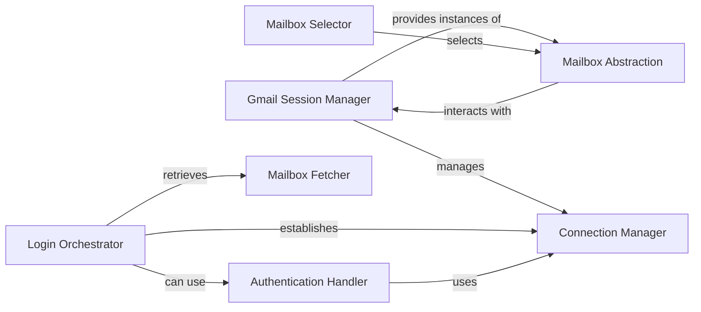

## Details

The gmail library provides a high-level interface for interacting with Gmail, centered around the Gmail Session Manager. This manager orchestrates the entire user session, handling authentication, network connections, and access to mailbox functionalities. The Login Orchestrator facilitates the initial session setup, either through direct IMAP login or by delegating to the Authentication Handler for OAuth2. Once authenticated, the Connection Manager maintains the underlying IMAP/SMTP connections. The Mailbox Fetcher discovers available mailboxes, which are then represented by Mailbox Abstraction instances. The Mailbox Selector allows the session to switch focus between these mailboxes, enabling operations on specific email folders.

### Gmail Session Manager [[Expand]](./Gmail_Session_Manager.md)
The core component and central entry point for the Gmail client library. It orchestrates the entire session lifecycle, managing authentication, network connections, and providing high-level access to Gmail functionalities. It acts as a facade, simplifying interactions for the end-user.

**Related Classes/Methods**:

- <a href="https://github.com/charlierguo/gmail/blob/master/gmail/gmail.py#L8-L186" target="_blank" rel="noopener noreferrer">`gmail.gmail.Gmail`:8-186</a>

### Login Orchestrator
A consolidated method within the Gmail Session Manager that streamlines the process of initiating a user session. It coordinates the sequence of authentication, establishing network connections, and fetching initial mailbox information. It supports both direct IMAP login and OAuth2 authentication.

**Related Classes/Methods**:

- <a href="https://github.com/charlierguo/gmail/blob/master/gmail/gmail.py#L93-L111" target="_blank" rel="noopener noreferrer">`gmail.gmail.Gmail.login`:93-111</a>

### Authentication Handler
Responsible for securely handling the OAuth2 authentication process with Google. It obtains and manages access tokens required for authorized interactions with the Gmail API.

**Related Classes/Methods**:

- <a href="https://github.com/charlierguo/gmail/blob/master/gmail/gmail.py#L113-L129" target="_blank" rel="noopener noreferrer">`gmail.gmail.Gmail.authenticate`:113-129</a>

### Connection Manager
Manages the establishment and maintenance of low-level IMAP and SMTP network connections to the Gmail servers. It handles the underlying communication channels for sending and receiving email data.

**Related Classes/Methods**:

- <a href="https://github.com/charlierguo/gmail/blob/master/gmail/gmail.py#L33-L49" target="_blank" rel="noopener noreferrer">`gmail.gmail.Gmail.connect`:33-49</a>

### Mailbox Fetcher
Queries the Gmail service to retrieve the list of all available mailboxes (labels) for the authenticated user. It populates the session's internal state with this information, making mailboxes accessible.

**Related Classes/Methods**:

- <a href="https://github.com/charlierguo/gmail/blob/master/gmail/gmail.py#L52-L59" target="_blank" rel="noopener noreferrer">`gmail.gmail.Gmail.fetch_mailboxes`:52-59</a>

### Mailbox Abstraction
Represents a specific Gmail mailbox (e.g., 'INBOX', 'Sent Mail'). This object provides methods for interacting with emails within that particular mailbox, abstracting the direct IMAP commands.

**Related Classes/Methods**:

- <a href="https://github.com/charlierguo/gmail/blob/master/gmail/mailbox.py#L5-L106" target="_blank" rel="noopener noreferrer">`gmail.mailbox.Mailbox`:5-106</a>

### Mailbox Selector
Manages the internal state of the session by switching the current operational context to a specified mailbox. This ensures that subsequent email operations target the correct folder.

**Related Classes/Methods**:

- <a href="https://github.com/charlierguo/gmail/blob/master/gmail/gmail.py#L61-L64" target="_blank" rel="noopener noreferrer">`gmail.gmail.Gmail.use_mailbox`:61-64</a>

### [FAQ](https://github.com/CodeBoarding/GeneratedOnBoardings/tree/main?tab=readme-ov-file#faq)