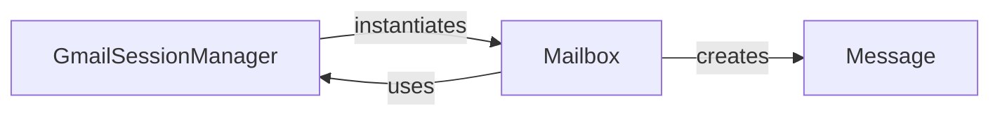

## Details

The `Mailbox Manager` subsystem primarily encompasses the `gmail.gmail` and `gmail.mailbox` modules, focusing on managing Gmail sessions, interacting with mailboxes, and handling mailbox-specific content operations. The `gmail.message` module, while not core to the *management* aspect, is a crucial dependency for representing the data handled by this subsystem.

### GmailSessionManager
This component serves as the primary entry point and facade for interacting with the Gmail service. It handles the overall session, including authentication and managing the underlying IMAP connection. It provides high-level methods for listing, creating, deleting, and selecting mailboxes, and acts as the orchestrator for initiating message searches across mailboxes. It is responsible for instantiating `Mailbox` objects.

**Related Classes/Methods**:

- <a href="https://github.com/charlierguo/gmail/blob/master/gmail/gmail.py" target="_blank" rel="noopener noreferrer">`GmailSessionManager`</a>

### Mailbox
Represents a specific Gmail mailbox (e.g., 'INBOX', 'Sent Mail'). This component encapsulates operations specific to its context, such as performing detailed searches within the mailbox, retrieving messages and threads, and providing counts of messages based on various criteria. It interacts with the `GmailSessionManager` for underlying IMAP communication.

**Related Classes/Methods**:

- <a href="https://github.com/charlierguo/gmail/blob/master/gmail/mailbox.py#L5-L106" target="_blank" rel="noopener noreferrer">`Mailbox`:5-106</a>

### Message
This component represents a single email message or thread. It holds structured message data and provides methods for parsing raw message data received from the IMAP server. While not directly involved in mailbox management logic, it is the fundamental data model produced and consumed by the `Mailbox` component.

**Related Classes/Methods**:

- <a href="https://github.com/charlierguo/gmail/blob/master/gmail/mailbox.py" target="_blank" rel="noopener noreferrer">`Message`</a>

### [FAQ](https://github.com/CodeBoarding/GeneratedOnBoardings/tree/main?tab=readme-ov-file#faq)