```mermaid
graph LR
    User_Application["User/Application"]
    Gmail_Session_Manager["Gmail Session Manager"]
    Mailbox_Manager["Mailbox Manager"]
    Email_Object_Handler["Email Object Handler"]
    Protocol_Encoding_Decoding_Utility["Protocol Encoding/Decoding Utility"]
    User_Application -- "initializes session" --> Gmail_Session_Manager
    Gmail_Session_Manager -- "provides session object" --> User_Application
    Gmail_Session_Manager -- "delegates mailbox operations" --> Mailbox_Manager
    Mailbox_Manager -- "utilizes session context" --> Gmail_Session_Manager
    Email_Object_Handler -- "requests action execution" --> Gmail_Session_Manager
    Mailbox_Manager -- "requests email objects" --> Email_Object_Handler
    Email_Object_Handler -- "utilizes for encoding/decoding" --> Protocol_Encoding_Decoding_Utility
    Protocol_Encoding_Decoding_Utility -- "provides encoded/decoded data" --> Email_Object_Handler
    click Gmail_Session_Manager href "https://github.com/CodeBoarding/GeneratedOnBoardings/blob/main/gmail/Gmail_Session_Manager.md" "Details"
    click Mailbox_Manager href "https://github.com/CodeBoarding/GeneratedOnBoardings/blob/main/gmail/Mailbox_Manager.md" "Details"
    click Email_Object_Handler href "https://github.com/CodeBoarding/GeneratedOnBoardings/blob/main/gmail/Email_Object_Handler.md" "Details"
```

## Details

The `gmail` library is structured around a clear separation of concerns, facilitating robust interaction with the Gmail service. At its core, the `User/Application` initiates all operations, interacting primarily with the `Gmail Session Manager`. This manager acts as the central orchestrator, handling authentication, connection, and maintaining the overall session state. It delegates specific tasks to specialized components like the `Mailbox Manager` for mailbox-level operations and the `Email Object Handler` for detailed email content manipulation. An internal `Protocol Encoding/Decoding Utility` ensures data integrity by managing IMAP-specific character encodings, supporting the `Email Object Handler` in its parsing and content handling responsibilities. This architecture promotes modularity, allowing for clear data flow and maintainable component boundaries, ideal for both documentation and visual diagram generation.

### User/Application
Represents the external consumer of the `gmail` library, initiating connections and operations.

**Related Classes/Methods**:

- <a href="https://github.com/charlierguo/gmail/blob/master/gmail/gmail.py#L8-L186" target="_blank" rel="noopener noreferrer">`gmail.gmail`:8-186</a>

### Gmail Session Manager [[Expand]](./Gmail_Session_Manager.md)
The central entry point and orchestrator. Manages authentication, connection, and overall session state with the Gmail service.

**Related Classes/Methods**:

- <a href="https://github.com/charlierguo/gmail/blob/master/gmail/gmail.py#L8-L186" target="_blank" rel="noopener noreferrer">`gmail.gmail`:8-186</a>

### Mailbox Manager [[Expand]](./Mailbox_Manager.md)
Handles interactions with Gmail mailboxes and labels, including listing, selecting, searching, and counting messages/threads within a mailbox.

**Related Classes/Methods**:

- <a href="https://github.com/charlierguo/gmail/blob/master/gmail/gmail.py" target="_blank" rel="noopener noreferrer">`gmail.mailbox`</a>
- <a href="https://github.com/charlierguo/gmail/blob/master/gmail/gmail.py#L8-L186" target="_blank" rel="noopener noreferrer">`gmail.gmail`:8-186</a>

### Email Object Handler [[Expand]](./Email_Object_Handler.md)
Encapsulates individual email messages and threads. Responsible for fetching, parsing, and performing actions (delete, move, archive) on email content and attachments.

**Related Classes/Methods**:

- <a href="https://github.com/charlierguo/gmail/blob/master/gmail/message.py" target="_blank" rel="noopener noreferrer">`gmail.message`</a>

### Protocol Encoding/Decoding Utility
An internal utility focused on handling specific character encodings (primarily Modified UTF-7) crucial for IMAP protocol compatibility and data integrity.

**Related Classes/Methods**:

- <a href="https://github.com/charlierguo/gmail/blob/master/gmail/utf.py" target="_blank" rel="noopener noreferrer">`gmail.utf`</a>

### [FAQ](https://github.com/CodeBoarding/GeneratedOnBoardings/tree/main?tab=readme-ov-file#faq)