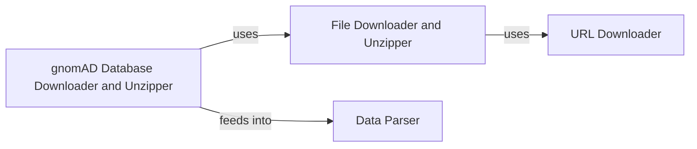

## Component Details

The Data Acquisition and Preparation component is responsible for fetching, decompressing, and parsing gnomAD data from remote sources. It automates the process of downloading gnomAD data files, extracting their contents, and transforming the raw data into pandas DataFrames for subsequent analysis and database insertion. The component ensures that the data is readily available and in a usable format for the downstream processes.

### URL Downloader
The URL Downloader component is responsible for downloading files from specified URLs. It establishes a connection to the remote server, retrieves the file, and saves it to a local destination. This component provides a basic file downloading functionality.
- **Related Classes/Methods**: `gnomad_db.utils:download_url`

### File Downloader and Unzipper
The File Downloader and Unzipper component extends the URL Downloader by adding the capability to automatically unzip downloaded files. It downloads a zipped file from a URL, saves it locally, and then extracts its contents to a specified directory. This component simplifies the process of obtaining and decompressing gnomAD data files.
- **Related Classes/Methods**: `gnomad_db.utils:download_and_unzip_file`

### gnomAD Database Downloader and Unzipper
The gnomAD Database Downloader and Unzipper component is a specialized version of the File Downloader and Unzipper tailored for the gnomAD database. It downloads and unzips specific files required for setting up the gnomAD database. This component provides a database-specific implementation of the download and unzip process.
- **Related Classes/Methods**: `gnomad_db.database.gnomAD_DB:download_and_unzip`

### Data Parser
The Data Parser component is responsible for parsing the downloaded and unzipped data into a usable format, specifically pandas DataFrames. This component converts the raw data into a structured format suitable for further analysis and database insertion. It handles the specific data formats used by gnomAD.
- **Related Classes/Methods**: _None_
