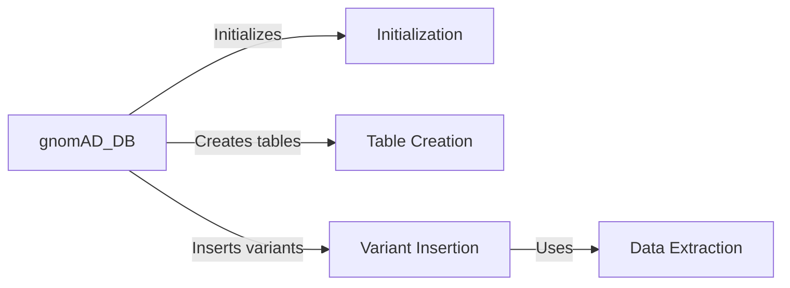

## Component Details

The Data Transformation and Loading component focuses on preparing variant data from DataFrames for efficient storage in the gnomAD database. It involves extracting relevant information from the DataFrames, structuring it according to the database schema, and then loading it into the database tables. This process ensures data integrity, optimizes data for querying, and facilitates downstream analysis.

### gnomAD_DB
The gnomAD_DB class serves as the central interface for interacting with the gnomAD database. It encapsulates functionalities for database initialization, table creation, and data insertion. It manages the database connection and provides methods for inserting variant data from Pandas DataFrames.
- **Related Classes/Methods**: `gnomad_db.database.gnomAD_DB`

### Initialization
The initialization process sets up the database connection and initializes the gnomAD_DB object. This involves establishing a connection to the database and preparing the database object for subsequent operations.
- **Related Classes/Methods**: `gnomad_db.database.gnomAD_DB:__init__`

### Table Creation
The table creation component defines and creates the necessary tables within the gnomAD database to store variant information. This ensures that the database schema is properly set up before data insertion.
- **Related Classes/Methods**: `gnomad_db.database.gnomAD_DB:create_table`

### Variant Insertion
The variant insertion component handles the process of inserting variant data into the gnomAD database. It takes Pandas DataFrames as input, extracts relevant information, and inserts it into the appropriate database tables.
- **Related Classes/Methods**: `gnomad_db.database.gnomAD_DB:insert_variants`

### Data Extraction
The data extraction component extracts specific information from Pandas DataFrames, preparing it for insertion into the database. It transforms the data into a format suitable for database storage.
- **Related Classes/Methods**: `gnomad_db.database.gnomAD_DB:_get_info_from_df`, `gnomad_db.database.gnomAD_DB:get_info_from_df`
