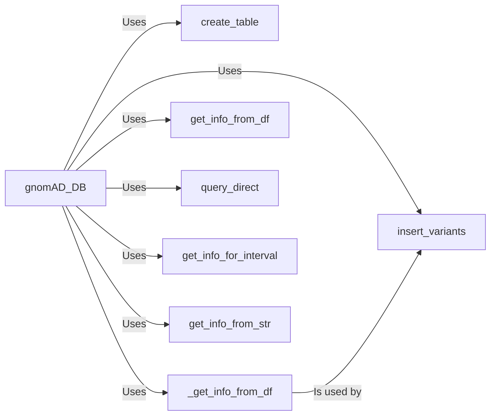

## Component Details

The gnomAD database management component provides a structured way to interact with a SQLite database containing variant information. It encapsulates database connection management, schema definition, data insertion, and querying capabilities. The central class, gnomAD_DB, offers methods to create tables, insert data from DataFrames, execute direct SQL queries, and retrieve variant information based on identifiers or genomic intervals. This component streamlines database operations, ensuring data integrity and efficient access to variant data.

### gnomAD_DB
The gnomAD_DB class is the core component responsible for managing the SQLite database connection. It provides methods for creating the database table, inserting variant data, and querying the database. It initializes the database connection and acts as the central point for all database interactions.
- **Related Classes/Methods**: `gnomad_db.database.gnomAD_DB`

### create_table
This component defines and creates the database table schema. It specifies the column names and data types required to store variant information, ensuring the database is structured correctly.
- **Related Classes/Methods**: `gnomad_db.database.gnomAD_DB:create_table`

### insert_variants
This component inserts variant data from a DataFrame into the database table. It handles data type conversions and error handling during the insertion process, ensuring data integrity.
- **Related Classes/Methods**: `gnomad_db.database.gnomAD_DB:insert_variants`

### _get_info_from_df
This component extracts relevant information from a DataFrame row to be inserted into the database. It parses the DataFrame row and extracts the necessary data fields for each variant, preparing the data for insertion into the database.
- **Related Classes/Methods**: `gnomad_db.database.gnomAD_DB:_get_info_from_df`

### get_info_from_df
This component retrieves variant information from the database based on variant identifiers provided in a DataFrame. It queries the database to retrieve information for specific variants.
- **Related Classes/Methods**: `gnomad_db.database.gnomAD_DB:get_info_from_df`

### query_direct
This component allows for executing direct SQL queries against the database. It provides flexibility in querying the database with custom SQL queries.
- **Related Classes/Methods**: `gnomad_db.database.gnomAD_DB:query_direct`

### get_info_for_interval
This component retrieves variant information for a specified genomic interval. It queries the database to retrieve all variants within a given genomic region.
- **Related Classes/Methods**: `gnomad_db.database.gnomAD_DB:get_info_for_interval`

### get_info_from_str
This component retrieves variant information based on a variant identifier string. It parses the variant identifier string and queries the database to retrieve information for that specific variant.
- **Related Classes/Methods**: `gnomad_db.database.gnomAD_DB:get_info_from_str`
