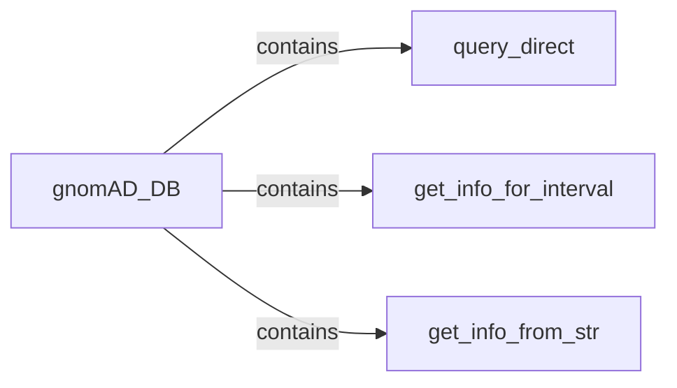

## Component Details

The Query Processing component provides an interface for querying the gnomAD database based on genomic intervals or variant identifiers. It retrieves relevant information from the database using the gnomAD_DB class and returns the results to the user. The main flow involves receiving a query, delegating the query execution to the appropriate method within gnomAD_DB (either query_direct, get_info_for_interval, or get_info_from_str), and returning the fetched data.

### gnomAD_DB
The central class responsible for managing interactions with the gnomAD database. It encapsulates the database connection and provides methods for querying and retrieving data. It acts as a facade, hiding the underlying database implementation details from other components.
- **Related Classes/Methods**: `gnomad_db.database.gnomAD_DB`

### query_direct
This method enables direct querying of the gnomAD database using a query language like SQL. It provides a flexible way to retrieve specific data based on complex query criteria. It interacts directly with the database through the gnomAD_DB class.
- **Related Classes/Methods**: `gnomad_db.database.gnomAD_DB:query_direct`

### get_info_for_interval
This method retrieves information from the gnomAD database for a given genomic interval. It constructs a query based on the interval coordinates and fetches the corresponding data. It simplifies the process of retrieving data for specific genomic regions.
- **Related Classes/Methods**: `gnomad_db.database.gnomAD_DB:get_info_for_interval`

### get_info_from_str
This method extracts information from a string representation of gnomAD data. It parses the string and returns the extracted data. This is useful for handling data in a specific string format and extracting relevant fields.
- **Related Classes/Methods**: `gnomad_db.database.gnomAD_DB:get_info_from_str`
