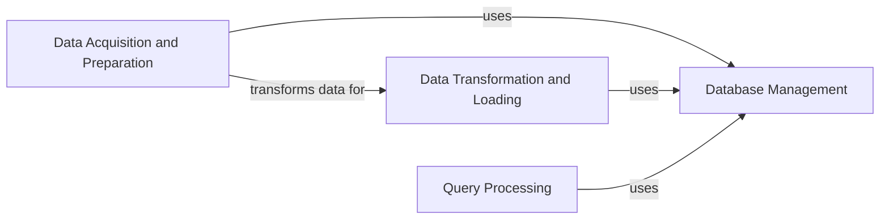

## Component Details

The gnomAD_DB project provides a streamlined interface for interacting with the gnomAD database, focusing on efficient data ingestion, transformation, and querying. The core functionality revolves around managing a SQLite database, populating it with gnomAD data, and providing methods to query this data based on genomic intervals or variant identifiers. The system automates the download and preparation of gnomAD data, transforming it into a suitable format for database insertion, and offering a query interface for retrieving variant information.

### Database Management
This component is responsible for handling the SQLite database. It includes creating the database, defining the schema, managing connections, and providing methods for interacting with the database, such as inserting data and executing queries. It serves as the central point for all database operations.
- **Related Classes/Methods**: `gnomad_db.database.gnomAD_DB`

### Data Acquisition and Preparation
This component focuses on acquiring gnomAD data from remote URLs, decompressing the downloaded files, and parsing the data into a usable format (pandas DataFrames). It automates the process of obtaining and preparing the data for subsequent transformation and insertion into the database.
- **Related Classes/Methods**: `gnomad_db.utils:download_url`, `gnomad_db.utils:download_and_unzip_file`, `gnomad_db.database.gnomAD_DB:download_and_unzip`

### Data Transformation and Loading
This component transforms the raw data from DataFrames into a format suitable for database insertion. It extracts relevant information, structures it appropriately, and loads it into the database using the Database Management component. This ensures data integrity and optimizes it for querying.
- **Related Classes/Methods**: `gnomad_db.database.gnomAD_DB:_get_info_from_df`, `gnomad_db.database.gnomAD_DB:get_info_from_df`, `gnomad_db.database.gnomAD_DB:insert_variants`

### Query Processing
This component provides the interface for querying the gnomAD database. It accepts queries based on genomic intervals or variant identifiers, retrieves the relevant information from the database, and returns the results to the user. It leverages the Database Management component to execute the queries and fetch the data.
- **Related Classes/Methods**: `gnomad_db.database.gnomAD_DB:query_direct`, `gnomad_db.database.gnomAD_DB:get_info_for_interval`, `gnomad_db.database.gnomAD_DB:get_info_from_str`