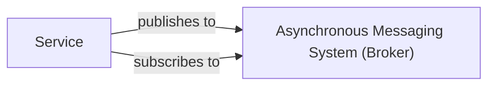

## Details

One paragraph explaining the functionality which is represented by this graph. What the main flow is and what is its purpose.

### Asynchronous Messaging System (Broker)
This component serves as the central message broker within the microservices framework, enabling decoupled and event-driven communication. It implements a publish/subscribe model, allowing various services to asynchronously exchange messages without direct dependencies, thereby enhancing the system's scalability, resilience, and flexibility.

**Related Classes/Methods**:

- `broker.go`

### Service
Represents a generic microservice in the system that interacts with the Asynchronous Messaging System (Broker). This component defines the fundamental interface and common characteristics for services built within the framework, enabling them to register, handle requests, and communicate asynchronously.

**Related Classes/Methods**:

- `server.go`

### [FAQ](https://github.com/CodeBoarding/GeneratedOnBoardings/tree/main?tab=readme-ov-file#faq)