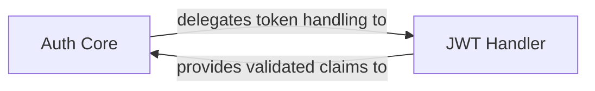

## Details

Secures inter-service communication by verifying identities and enforcing permissions across the microservices framework. It acts as a critical security layer, ensuring that only authenticated and authorized services and users can interact with specific resources and functionalities.

### Auth Core
The central orchestrator for all authentication and authorization processes. It defines the core interfaces and logic for identity verification and policy enforcement.

**Related Classes/Methods**:

- `auth/auth.go` (1:1)

### JWT Handler
Specializes in the secure creation, validation, and parsing of JSON Web Tokens (JWTs), which are used for propagating identity and authorization claims across services.

**Related Classes/Methods**:

- `auth/jwt/jwt.go` (1:1)

### [FAQ](https://github.com/CodeBoarding/GeneratedOnBoardings/tree/main?tab=readme-ov-file#faq)