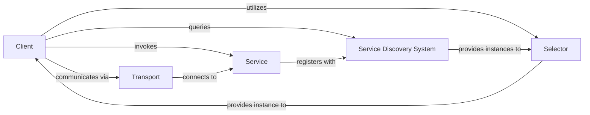

## Details

One paragraph explaining the functionality which is represented by this graph. What the main flow is and what is its purpose.

### Client
The central orchestrator for client-side service invocation. It abstracts the complexities of finding, selecting, and communicating with remote services, providing a unified interface for consumers. It manages the lifecycle of a service call, from initial request to response handling.

**Related Classes/Methods**:

- `client` (1:1)

### Service
Represents a deployable unit of business functionality in the microservices architecture. It exposes interfaces that can be discovered and invoked by clients.

**Related Classes/Methods**:

- `server` (1:1)

### Selector
Responsible for applying load balancing strategies and routing logic to choose a specific healthy instance of a service from a pool of available instances. It ensures efficient distribution of requests and fault tolerance.

**Related Classes/Methods**:

- `selector` (1:1)

### Transport
Manages the underlying network communication protocols and mechanisms (e.g., RPC, HTTP) for sending requests and receiving responses between the client and the selected service instance. It handles serialization, deserialization, and network I/O.

**Related Classes/Methods**:

- `transport` (1:1)

### Service Discovery System
A dynamic registry that allows service instances to register their network locations upon startup and clients to query for available service instances. It is crucial for decoupling services and enabling dynamic scaling.

**Related Classes/Methods**:

- `registry` (1:1)

### [FAQ](https://github.com/CodeBoarding/GeneratedOnBoardings/tree/main?tab=readme-ov-file#faq)