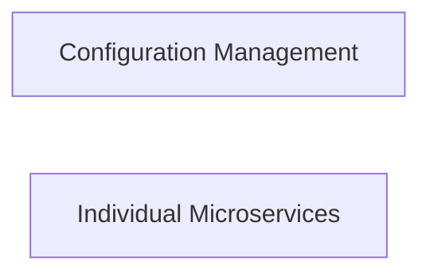

## Details

One paragraph explaining the functionality which is represented by this graph. What the main flow is and what is its purpose.

### Configuration Management [[Expand]](./Configuration_Management.md)
This component provides a centralized and dynamic mechanism for externalizing and updating service configurations at runtime. It allows individual microservices to retrieve their operational parameters and settings without requiring a redeployment, facilitating agile updates and environment-specific configurations.

**Related Classes/Methods**:

- `config/config.go` (1:1)

### Individual Microservices
This component represents a standalone, independently deployable service that encapsulates a specific business capability. Each microservice runs its own process and communicates with other services, typically through lightweight mechanisms. It is responsible for handling requests, processing business logic, and interacting with its own data store or other services as needed, while also retrieving its operational parameters and settings from a configuration management system.

**Related Classes/Methods**:

- `server/server.go` (1:1)
- `server/http.go` (1:1)
- `server/grpc.go` (1:1)
- `server/options.go` (1:1)

### [FAQ](https://github.com/CodeBoarding/GeneratedOnBoardings/tree/main?tab=readme-ov-file#faq)