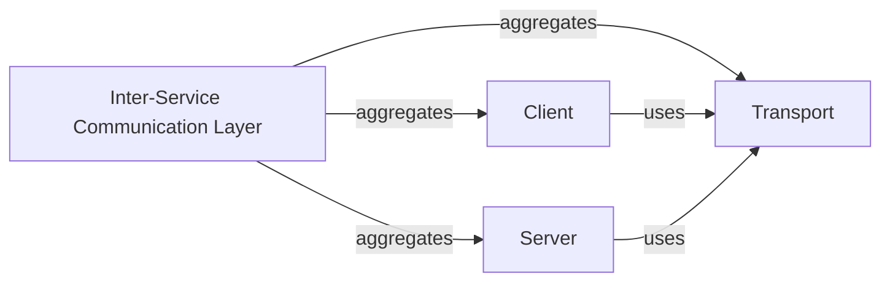

## Details

One paragraph explaining the functionality which is represented by this graph. What the main flow is and what is its purpose.

### Inter-Service Communication Layer [[Expand]](./Inter_Service_Communication_Layer.md)
This overarching component manages synchronous RPC communication between services. It encapsulates the mechanisms for network transport, data serialization, and deserialization, forming the backbone for service-to-service interaction in a microservices framework. Its design promotes modularity, allowing for flexible integration of different transport protocols and serialization formats.

**Related Classes/Methods**:

- `client.go` (1:1)
- `server.go` (1:1)

### Client
Responsible for initiating RPC calls from one service to another. This includes handling the serialization of outgoing requests, interacting with service discovery mechanisms to locate target services, and leveraging load balancing for efficient request distribution.

**Related Classes/Methods**:

- `client.go` (1:1)

### Server
Manages the reception and processing of incoming RPC requests. It listens for requests, deserializes the received data, and dispatches these requests to the appropriate service handlers for processing.

**Related Classes/Methods**:

- `server.go` (1:1)

### Transport
Provides the fundamental network communication mechanism for the RPC layer. It abstracts away the complexities of data transmission, handling the actual byte-level sending and receiving of information between services. This component ensures that Client and Server can communicate effectively regardless of the underlying network protocol.

**Related Classes/Methods**:

- `transport/transport.go` (1:1)

### [FAQ](https://github.com/CodeBoarding/GeneratedOnBoardings/tree/main?tab=readme-ov-file#faq)