```mermaid
graph LR
    Service_Discovery_Registry["Service Discovery & Registry"]
    Individual_Microservices["Individual Microservices"]
    RPC_Communication_Layer["RPC Communication Layer"]
    Selector_Resolver["Selector/Resolver"]
    Client_Side_Load_Balancer["Client-Side Load Balancer"]
    Individual_Microservices -- "registers with" --> Service_Discovery_Registry
    Selector_Resolver -- "queries" --> Service_Discovery_Registry
    Individual_Microservices -- "communicates via" --> RPC_Communication_Layer
    RPC_Communication_Layer -- "performs lookup via" --> Service_Discovery_Registry
    Selector_Resolver -- "provides instances to" --> Client_Side_Load_Balancer
    Client_Side_Load_Balancer -- "receives instances from" --> Selector_Resolver
    Client_Side_Load_Balancer -- "directs requests to" --> Individual_Microservices
    click Service_Discovery_Registry href "https://github.com/CodeBoarding/GeneratedOnBoardings/blob/main/go-micro/Service_Discovery_Registry.md" "Details"
```

## Details

One paragraph explaining the functionality which is represented by this graph. What the main flow is and what is its purpose.

### Service Discovery & Registry [[Expand]](./Service_Discovery_Registry.md)
This component acts as the authoritative directory for all microservice instances within the system. It facilitates dynamic registration of service endpoints by individual microservices and provides a mechanism for other services to discover available and healthy instances. It maintains an up-to-date list of active services, which is critical for enabling client-side load balancing and ensuring high availability.

**Related Classes/Methods**: _None_

### Individual Microservices
These are the independent, deployable units of business functionality that form the core of the application. Each microservice is responsible for registering its network location and health status with the Service Discovery & Registry upon startup and uses the RPC Communication Layer to interact with other services.

**Related Classes/Methods**: _None_

### RPC Communication Layer
This layer provides the foundational mechanism for inter-service communication, allowing microservices to invoke functions or procedures on remote services. The client-side of this layer integrates with the Service Discovery & Registry to resolve service names into concrete network addresses before initiating communication.

**Related Classes/Methods**: _None_

### Selector/Resolver
This component is responsible for abstracting the service lookup process. It queries the Service Discovery & Registry to translate a logical service name into a list of physical network addresses of available and healthy service instances. It then typically passes this list to a client-side load balancer.

**Related Classes/Methods**: _None_

### Client-Side Load Balancer
Operating on the client-side, this component receives a list of available service instances from the Selector/Resolver (which sourced them from the Service Discovery). It then applies a specific load balancing algorithm (e.g., round-robin, least connections) to distribute outgoing requests across these instances, enhancing service reliability and performance.

**Related Classes/Methods**: _None_

### [FAQ](https://github.com/CodeBoarding/GeneratedOnBoardings/tree/main?tab=readme-ov-file#faq)