```mermaid
graph LR
    Service_Core["Service Core"]
    Service_Discovery_Registry["Service Discovery & Registry"]
    Inter_Service_Communication_Layer["Inter-Service Communication Layer"]
    Asynchronous_Messaging_System["Asynchronous Messaging System"]
    Client_Side_Service_Invocation["Client-Side Service Invocation"]
    Configuration_Management["Configuration Management"]
    Authentication_Authorization_System["Authentication & Authorization System"]
    Service_Core -- "registers with" --> Service_Discovery_Registry
    Service_Core -- "exposes/handles requests via" --> Inter_Service_Communication_Layer
    Service_Core -- "communicates via" --> Asynchronous_Messaging_System
    Service_Core -- "receives updates from" --> Configuration_Management
    Service_Discovery_Registry -- "provides instances to" --> Client_Side_Service_Invocation
    Client_Side_Service_Invocation -- "queries" --> Service_Discovery_Registry
    Client_Side_Service_Invocation -- "sends requests via" --> Inter_Service_Communication_Layer
    Inter_Service_Communication_Layer -- "integrates with" --> Authentication_Authorization_System
    Authentication_Authorization_System -- "intercepts requests in" --> Inter_Service_Communication_Layer
    click Service_Discovery_Registry href "https://github.com/CodeBoarding/GeneratedOnBoardings/blob/main/go-micro/Service_Discovery_Registry.md" "Details"
    click Inter_Service_Communication_Layer href "https://github.com/CodeBoarding/GeneratedOnBoardings/blob/main/go-micro/Inter_Service_Communication_Layer.md" "Details"
    click Asynchronous_Messaging_System href "https://github.com/CodeBoarding/GeneratedOnBoardings/blob/main/go-micro/Asynchronous_Messaging_System.md" "Details"
    click Client_Side_Service_Invocation href "https://github.com/CodeBoarding/GeneratedOnBoardings/blob/main/go-micro/Client_Side_Service_Invocation.md" "Details"
    click Configuration_Management href "https://github.com/CodeBoarding/GeneratedOnBoardings/blob/main/go-micro/Configuration_Management.md" "Details"
    click Authentication_Authorization_System href "https://github.com/CodeBoarding/GeneratedOnBoardings/blob/main/go-micro/Authentication_Authorization_System.md" "Details"
```

## Details

One paragraph explaining the functionality which is represented by this graph. What the main flow is and what is its purpose.

### Service Core
Encapsulates the business logic of an individual microservice, managing its lifecycle and integrating with the framework's infrastructure.

**Related Classes/Methods**: _None_

### Service Discovery & Registry [[Expand]](./Service_Discovery_Registry.md)
Enables dynamic service lookup and registration, maintaining a list of available and healthy service instances.

**Related Classes/Methods**: _None_

### Inter-Service Communication Layer [[Expand]](./Inter_Service_Communication_Layer.md)
Handles synchronous RPC communication between services, including network transport and data serialization/deserialization.

**Related Classes/Methods**:

- `client/client.go`
- `server/server.go`

### Asynchronous Messaging System [[Expand]](./Asynchronous_Messaging_System.md)
Provides decoupled, event-driven communication via a publish/subscribe model, acting as a message broker.

**Related Classes/Methods**:

- `broker/broker.go`

### Client-Side Service Invocation [[Expand]](./Client_Side_Service_Invocation.md)
Abstracts the complexity for clients to call remote services, handling service lookup, load balancing, and request routing.

**Related Classes/Methods**:

- `client/client.go`

### Configuration Management [[Expand]](./Configuration_Management.md)
Offers a centralized and dynamic mechanism for externalizing and updating service configurations at runtime.

**Related Classes/Methods**:

- `config/config.go`

### Authentication & Authorization System [[Expand]](./Authentication_Authorization_System.md)
Secures inter-service communication by verifying identities and enforcing permissions.

**Related Classes/Methods**:

- `auth/auth.go`
- `auth/jwt/jwt.go`

### [FAQ](https://github.com/CodeBoarding/GeneratedOnBoardings/tree/main?tab=readme-ov-file#faq)