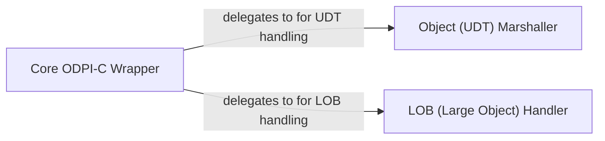

## Details

This analysis details the internal architecture of the CGO Bridge, the Foreign Function Interface (FFI) layer responsible for communication between the Go-based godror driver and the C-based ODPI-C library.

### Core ODPI-C Wrapper
The central component of the FFI layer. It wraps the fundamental ODPI-C functions for context creation, connection management, statement preparation, and execution. It acts as the primary gateway for the higher-level Go driver to interact with the Oracle database client.

**Related Classes/Methods**:

- `odpi.go`

### Object (UDT) Marshaller
A specialized component responsible for handling Oracle's User-Defined Types (UDTs) and other complex objects. It manages the intricate memory layout and data conversion required to marshal data between Go structs and ODPI-C object handles.

**Related Classes/Methods**:

- `z_obj.go`

### LOB (Large Object) Handler
This component provides dedicated functions for managing Large Object (LOB) data types, such as CLOB and BLOB. It handles operations like reading, writing, and streaming large data chunks, which require special C-level functions distinct from standard data types.

**Related Classes/Methods**:

- `z_lob.go`

### [FAQ](https://github.com/CodeBoarding/GeneratedOnBoardings/tree/main?tab=readme-ov-file#faq)